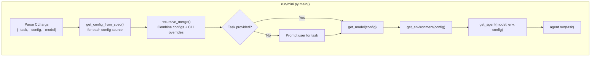

# TDD Guide: CLI Entry Point in Go — Phase 14

This guide walks through implementing the command-line interface (CLI) for your Go agent using strict TDD (red-green-refactor). 

By the end of this phase, you will have an executable that parses CLI flags, loads YAML config files, constructs the Model and Environment, wires them into the Agent, and runs a task end-to-end.

> [!IMPORTANT]
> **Source of truth:** Always refer back to [run/mini.py](file:///home/rvald/mini-swe-agent/src/minisweagent/run/mini.py) when in doubt about behavior.

---

## How the Python CLI Works (Reference)



### Key Python Components

| Python Component | What it does | Go equivalent |
|---|---|---|
| `typer.Option` | Defines CLI flags | `flag`, `pflag`, or `cobra` |
| `get_config_from_spec` | Loads YAML or parses `key=val` | `config.GetConfigFromSpec` (Phase 12) |
| `get_model` | Factory that instantiates the model | `NewOpenAIModel` (Phase 13) |
| `get_environment` | Factory that instantiates the env | `NewLocalEnvironment` (Phase 11) |
| `get_agent` | Factory that instantiates the agent | `NewDefaultAgent` (Phase 0-10) |
| `agent.run(task)` | Starts the main feedback loop | `agent.Run(task)` |

---

## File Structure

For CLI applications in Go, the standard layout places the main package in `cmd/`. The actual CLI parsing logic is often extracted into an `internal/cli` or `internal/app` package so it can be tested without compiling the binary.

```
cmd/mini/
└── main.go            # Minimal entry point: os.Exit(cli.Run(os.Args))
internal/cli/
├── app.go             # CLI flag parsing and wiring
└── app_test.go        # All tests (white-box)
```

At the top of `cmd/mini/main.go`:
```go
package main
```

At the top of `internal/cli/*.go`:
```go
package cli
```

> [!NOTE]
> **CLI Library Choice:** You can use the standard library `flag`, `github.com/spf13/pflag` (drop-in replacement with POSIX flags), or `github.com/spf13/cobra` (for subcommands). Since `mini` is a single command with many flags, `pflag` is the most lightweight option that matches Python's Typer/Click interface, but sticking to standard `flag` is perfectly fine for TDD. The examples below assume you are parsing args manually or using standard `flag` for simplicity in tests.

---

## Phase 1: Flag Parsing and Config Merging

### Step 1.1 — Parse Flags into Overrides Map

**What Python does:** CLI flags like `--model gpt-4` or `--cost-limit 5.0` are packed into a dictionary block and merged on top of the YAML config files.

```python
configs.append({
    "run": {"task": task},
    "agent": {"cost_limit": cost_limit},
    "model": {"model_name": model_name},
})
```

**🔴 RED** — In `app_test.go`:

```go
func TestParseFlagsToConfigOverride(t *testing.T) {
    args := []string{
        "--task", "Fix the bug",
        "--model", "gpt-4",
        "--cost-limit", "5.0",
        "--config", "test.yaml", // Not used for override map, but should be parsed
    }
    
    app := NewApp()
    err := app.ParseArgs(args)
    if err != nil {
        t.Fatalf("unexpected error: %v", err)
    }

    if app.Task != "Fix the bug" {
        t.Errorf("Task = %q, want 'Fix the bug'", app.Task)
    }
    if len(app.ConfigFiles) != 1 || app.ConfigFiles[0] != "test.yaml" {
        t.Errorf("ConfigFiles = %v, want ['test.yaml']", app.ConfigFiles)
    }

    // Check the generated override config map
    override := app.GetCLIOverrideConfig()
    
    agent, ok := override.Agent
    if !ok || agent["cost_limit"] != 5.0 {
        t.Errorf("Agent cost_limit = %v, want 5.0", agent["cost_limit"])
    }
    
    model, ok := override.Model
    if !ok || model["model_name"] != "gpt-4" {
        t.Errorf("Model model_name = %v, want 'gpt-4'", model["model_name"])
    }
}
```

**🟢 GREEN** — In `app.go`:

```go
import "flag"

type App struct {
    Task        string
    Model       string
    CostLimit   float64
    ConfigFiles []string
    // Unused flags like yolo, agent_class, environment_class can be added later
}

func NewApp() *App {
    return &App{}
}

// stringSlice implements flag.Value to allow multiple --config flags
type stringSlice []string
func (i *stringSlice) String() string { return fmt.Sprint(*i) }
func (i *stringSlice) Set(value string) error {
    *i = append(*i, value)
    return nil
}

func (a *App) ParseArgs(args []string) error {
    fs := flag.NewFlagSet("mini", flag.ContinueOnError)
    
    fs.StringVar(&a.Task, "task", "", "Task/problem statement")
    fs.StringVar(&a.Model, "model", "", "Model to use")
    fs.Float64Var(&a.CostLimit, "cost-limit", -1, "Cost limit. Set to 0 to disable.")
    
    var configs stringSlice
    fs.Var(&configs, "config", "Path to config files or key-value pairs")
    
    if err := fs.Parse(args); err != nil {
        return err
    }
    
    a.ConfigFiles = configs
    return nil
}

// Assumes config.RawConfig from Phase 12
func (a *App) GetCLIOverrideConfig() config.RawConfig {
    cfg := config.RawConfig{
        Agent: make(map[string]any),
        Model: make(map[string]any),
    }
    
    if a.CostLimit >= 0 {
        cfg.Agent["cost_limit"] = a.CostLimit
    }
    if a.Model != "" {
        cfg.Model["model_name"] = a.Model
    }
    return cfg
}
```

---

### Step 1.2 — Merging File Configs and CLI Flags

**🔴 RED:**

```go
func TestBuildFinalConfig(t *testing.T) {
    // We need to mock config.LoadAndMerge or rely on a real testdata file
    // Assuming config package handles the actual file loading, App just calls it.
    
    app := NewApp()
    app.ConfigFiles = []string{"agent.step_limit=10"} // valid key-value spec
    app.CostLimit = 5.0 // From CLI flag
    
    finalConfig, err := app.BuildFinalConfig()
    if err != nil {
        t.Fatalf("unexpected error: %v", err)
    }
    
    if finalConfig.Agent["step_limit"] != float64(10) {
        t.Errorf("step_limit from spec = %v, want 10", finalConfig.Agent["step_limit"])
    }
    if finalConfig.Agent["cost_limit"] != 5.0 {
        t.Errorf("cost_limit from CLI flag = %v, want 5.0", finalConfig.Agent["cost_limit"])
    }
}
```

**🟢 GREEN:**

```go
func (a *App) BuildFinalConfig() (config.RawConfig, error) {
    // If no configs specified, Python defaults to "mini.yaml", we can add that logic here.
    fileCfg, err := config.LoadAndMerge(a.ConfigFiles)
    if err != nil {
        return config.RawConfig{}, err
    }
    
    overrideCfg := a.GetCLIOverrideConfig()
    
    return config.MergeConfigs(fileCfg, overrideCfg), nil
}
```

---

## Phase 2: Dependency Injection (Wiring)

### Step 2.1 — Wiring the Types

This is the core of `run()`. We convert raw `map[string]any` configurations into typed structs and pass them into the constructors of our Phase 0-13 components.

**🔴 RED:**

To test this without doing network calls or real file ops, we use the `DeterministicModel` (mock) and an injected `Environment` factory.

```go
func TestBuildAgent(t *testing.T) {
    rawCfg := config.RawConfig{
        Agent: map[string]any{
            "system_template": "sys",
            "instance_template": "inst",
        },
        Model: map[string]any{
            "model_name": "test-mock",
        },
    }
    
    app := NewApp()
    
    // We want to verify it instantiates properly
    ag, err := app.AssembleAgent(rawCfg)
    if err != nil {
        t.Fatalf("unexpected error: %v", err)
    }
    if ag == nil {
        t.Fatal("expected non-nil agent")
    }
}
```

**🟢 GREEN:**

```go
// Assumes building typed configs from Phase 12: config.BuildAgentConfig, etc.

func (a *App) AssembleAgent(raw config.RawConfig) (*agent.DefaultAgent, error) {
    agentCfg, err := config.BuildAgentConfig(raw.Agent)
    if err != nil {
        return nil, fmt.Errorf("building agent config: %w", err)
    }
    if err := config.ValidateAgentConfig(agentCfg); err != nil {
        return nil, err
    }
    
    modelCfg, err := config.BuildModelConfig(raw.Model)
    if err != nil {
        return nil, fmt.Errorf("building model config: %w", err)
    }
    
    envCfg, err := config.BuildEnvironmentConfig(raw.Environment)
    if err != nil {
        return nil, fmt.Errorf("building env config: %w", err)
    }
    
    // Instantiate components
    // Note: Python's `get_model` checks `model_class`, defaulting to litellm.
    // For Go, you might switch on ModelName or a ModelClass config field.
    m := model.NewOpenAIModel(modelCfg, os.Getenv("OPENAI_API_KEY"))
    e := environment.NewLocalEnvironment(envCfg)
    
    ag := agent.NewDefaultAgent(agentCfg, m, e)
    return ag, nil
}
```

---

## Phase 3: The Run Loop

### Step 3.1 — Prompt for Task if Missing

**Python behavior:** If `--task` is missing, `_multiline_prompt()` asks the user.

**🔴 RED:**

```go
func TestPromptForTask(t *testing.T) {
    app := NewApp()
    // Override stdin for testing
    input := "Fix the login bug\nEOF\n"
    r, w, _ := os.Pipe()
    w.Write([]byte(input))
    w.Close()
    
    // Swap global or pass reader
    task, err := app.GetTask(r)
    if err != nil {
        t.Fatalf("unexpected error: %v", err)
    }
    if task != "Fix the login bug\n" { // Adjust based on your multiline prompt rules
        t.Errorf("Task = %q", task)
    }
}
```

**🟢 GREEN:**

```go
func (a *App) GetTask(r io.Reader) (string, error) {
    if a.Task != "" {
        return a.Task, nil
    }
    
    fmt.Println("What do you want to do? (Press Ctrl+D to submit)")
    bytes, err := io.ReadAll(r)
    if err != nil {
        return "", err
    }
    return strings.TrimSpace(string(bytes)), nil
}
```

---

### Step 3.2 — Full Execution pipeline

**🔴 RED:**

This is hard to test automatically without hitting the real API because `AssembleAgent` hardcodes `NewOpenAIModel`. 

> [!CAUTION]
> **Dependency Inversion.** To make `AssembleAgent` unit-testable end-to-end, you shouldn't hardcode `NewOpenAIModel` and `NewLocalEnvironment`. In Go, the CLI application struct usually accepts `AgentFactory`, `ModelFactory` functions, or interfaces to allow mocking.

Let's refactor `App` slightly for testing:

```go
func TestAppRunEndToEnd(t *testing.T) {
    app := NewApp()
    app.Task = "test task"
    // Inject mocks
    app.ModelFactory = func(cfg config.ModelConfig) model.ModelInterface {
        return &agent.MockModel{Responses: []agent.Message{{Role: "assistant", Extra: map[string]any{"actions": []agent.Action{{Command: "echo hi"}}}}}}
    }
    app.EnvFactory = func(cfg config.EnvConfig) env.EnvironmentInterface {
        return &agent.MockEnv{Outputs: []agent.Observation{{Output: "COMPLETE_TASK_AND_SUBMIT_FINAL_OUTPUT\ndone\n", ReturnCode: 0}}}
    }

    // You would provide an initial valid YAML configuration via mock or file
    app.ConfigFiles = []string{"agent.system_template=sys", "agent.instance_template=inst"}

    err := app.Run()
    if err != nil {
        t.Fatalf("unexpected error: %v", err)
    }
}
```

---

## Phase 4: Main Entry Point

Create `cmd/mini/main.go` to tie it all together:

```go
package main

import (
    "fmt"
    "os"
    "github.com/your-repo/internal/cli"
)

func main() {
    app := cli.NewApp()
    
    // In production, we use the real factories
    app.ModelFactory = cli.DefaultModelFactory
    app.EnvFactory = cli.DefaultEnvFactory
    
    if err := app.ParseArgs(os.Args[1:]); err != nil {
        fmt.Fprintf(os.Stderr, "Error parsing arguments: %v\n", err)
        os.Exit(1)
    }
    
    if err := app.Run(); err != nil {
        fmt.Fprintf(os.Stderr, "Agent failed: %v\n", err)
        os.Exit(1)
    }
}
```

---

## Summary — Implementation Order

| Step | Test file | Production file | What you're proving |
|---|---|---|---|
| 1.1 | `TestParseFlagsToConfigOverride` | `app.go` | Flags correctly hydrate the overrides map |
| 1.2 | `TestBuildFinalConfig` | `app.go` | Overrides are merged cleanly over file config |
| 2.1 | `TestBuildAgent` | `app.go` | Raw map correctly wires typed structs into constructor |
| 3.1 | `TestPromptForTask` | `app.go` | Interactive task prompt works if `--task` is absent |
| 3.2 | `TestAppRunEndToEnd` | `app.go` | The full wiring executes successfully |
| 4.1 | (Manual test) | `cmd/mini/main.go` | The binary compiles and runs |

Once this runs, your agent is officially alive and usable from the terminal! You can run:

```bash
go run cmd/mini/main.go --task "Write a python script that prints hello world"
```
