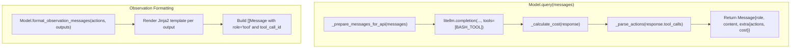

# TDD Guide: Concrete Model in Go — Phase 13

This guide walks through implementing a concrete LLM module in Go using strict TDD (red-green-refactor). This builds upon the `Model` interface you defined in Phase 2 of the DefaultAgent guide.

By the end of this phase, you will have a `LiteLLMModel` (or an OpenAI-compatible equivalent) that can parse action tool-calls, format messages, and execute queries against an LLM API.

> [!IMPORTANT]
> **Source of truth:** Always refer back to [models/litellm_model.py](file:///home/rvald/mini-swe-agent/src/minisweagent/models/litellm_model.py) and [models/utils/actions_toolcall.py](file:///home/rvald/mini-swe-agent/src/minisweagent/models/utils/actions_toolcall.py) when in doubt about behavior.

---

## How the Python Model Works (Reference)



### Key Python Components

| Python Component | What it does | Go equivalent |
|---|---|---|
| `LitellmModelConfig` | Holds `model_name`, `model_kwargs`, `observation_template`, `format_error_template` | Go struct with tags |
| `BASH_TOOL` | JSON Schema for the `bash(command)` tool | Go struct (e.g. `sashabaranov/go-openai.Tool`) |
| `query()` | Calls API, extracts `.choices[0]`, parses cost & tool calls | `Query([]Message) (Message, error)` |
| `parse_toolcall_actions()` | Validates tool names and extracts arguments | Helper function |
| `format_observation_messages()` | Renders output template, creates `tool` messages | `FormatObservationMessages(Message, []Observation) []Message` |
| `FormatError` | Raised if model hallucinates tools or misses them | Returned as `*agent.FormatError` |

---

## File Structure

```
internal/model/
├── types.go           # Config struct 
├── openai.go          # OpenAI-compatible API model logic
├── toolcall.go        # Tool call parsing and formatting
└── openai_test.go     # All tests (white-box)
```

At the top of every file:

```go
package model
```

> [!NOTE]
> **Dependencies.** This package will import `internal/agent` (for types like `Message`, `Action`, `Observation`, `FormatError`) and `internal/utils` (if you extracted `renderTemplate` or `recursiveMerge`). You will likely need an OpenAI client library like `github.com/sashabaranov/go-openai`.

---

## Phase 1: Model Config and Constructor

### Step 1.1 — ModelConfig Struct

**What it is in Python:**
```python
class LitellmModelConfig(BaseModel):
    model_name: str
    model_kwargs: dict[str, Any] = {}
    format_error_template: str = "{{ error }}"
    observation_template: str = "..."
```

**🔴 RED** — In `openai_test.go`:

```go
func TestModelConfigDefaults(t *testing.T) {
    cfg := ModelConfig{
        ModelName: "gpt-4",
    }
    if cfg.ModelName != "gpt-4" {
        t.Errorf("ModelName = %q, want 'gpt-4'", cfg.ModelName)
    }
    if cfg.ModelKwargs != nil {
        t.Errorf("ModelKwargs should be nil or empty map initially")
    }
}
```

**🟢 GREEN** — In `types.go`:

```go
type ModelConfig struct {
    ModelName           string         `json:"model_name" yaml:"model_name"`
    ModelKwargs         map[string]any `json:"model_kwargs" yaml:"model_kwargs"`
    FormatErrorTemplate string         `json:"format_error_template" yaml:"format_error_template"`
    ObservationTemplate string         `json:"observation_template" yaml:"observation_template"`
}
```

---

### Step 1.2 — Constructor and API Client

**🔴 RED:**

```go
func TestNewOpenAIModel(t *testing.T) {
    cfg := ModelConfig{ModelName: "gpt-4"}
    // For testing without hitting network, we'll need an interface for the API client or a way to override the base URL.
    model := NewOpenAIModel(cfg, "fake-api-key")
    if model == nil {
        t.Fatal("expected non-nil model")
    }
    if model.config.ModelName != "gpt-4" {
        t.Errorf("model name not stored")
    }
}
```

**🟢 GREEN** — In `openai.go`:

```go
import "github.com/sashabaranov/go-openai"

type OpenAIModel struct {
    config ModelConfig
    client *openai.Client
}

func NewOpenAIModel(cfg ModelConfig, apiKey string) *OpenAIModel {
    // Note: To support custom litellm/ollama proxy endpoints, you would configure the client's BaseURL here.
    client := openai.NewClient(apiKey)
    return &OpenAIModel{
        config: cfg,
        client: client,
    }
}
```

---

## Phase 2: Action Parsing 

### Step 2.1 — Parsing Valid Tool Calls

**What Python does:** `parse_toolcall_actions` takes `response.choices[0].message.tool_calls` and extracts `{"command": args["command"], "tool_call_id": tool.id}`.

**🔴 RED:**

```go
func TestParseToolCallsHappyPath(t *testing.T) {
    // using github.com/sashabaranov/go-openai types
    toolCalls := []openai.ToolCall{
        {
            ID: "call_123",
            Function: openai.FunctionCall{
                Name:      "bash",
                Arguments: `{"command": "echo hi"}`,
            },
        },
    }
    
    actions, err := parseToolCallActions(toolCalls, "Format error: {{.Error}}")
    if err != nil {
        t.Fatalf("unexpected error: %v", err)
    }
    if len(actions) != 1 {
        t.Fatalf("expected 1 action, got %d", len(actions))
    }
    if actions[0].Command != "echo hi" {
        t.Errorf("Command = %q, want 'echo hi'", actions[0].Command)
    }
    if actions[0].ToolCallID != "call_123" {
        t.Errorf("ToolCallID = %q, want 'call_123'", actions[0].ToolCallID)
    }
}
```

**🟢 GREEN** — In `toolcall.go`:

```go
import (
    "encoding/json"
    "fmt"
    "github.com/your-module/internal/agent"
    "github.com/sashabaranov/go-openai"
)

func parseToolCallActions(toolCalls []openai.ToolCall, errorTemplate string) ([]agent.Action, error) {
    if len(toolCalls) == 0 {
        return nil, newFormatError("No tool calls found in the response. Every response MUST include at least one tool call.", errorTemplate)
    }
    
    var actions []agent.Action
    for _, tc := range toolCalls {
        errorMsg := ""
        if tc.Function.Name != "bash" {
            errorMsg += fmt.Sprintf("Unknown tool '%s'. ", tc.Function.Name)
        }
        
        var args map[string]any
        if err := json.Unmarshal([]byte(tc.Function.Arguments), &args); err != nil {
            errorMsg += fmt.Sprintf("Error parsing tool call arguments: %v. ", err)
        }
        
        cmdStr, ok := args["command"].(string)
        if !ok {
            errorMsg += "Missing 'command' argument in bash tool call. "
        }
        
        if errorMsg != "" {
            return nil, newFormatError(errorMsg, errorTemplate)
        }
        
        actions = append(actions, agent.Action{
            Command:    cmdStr,
            ToolCallID: tc.ID,
        })
    }
    return actions, nil
}

func newFormatError(errMsg string, tmpl string) error {
    // Assuming renderTemplate logic is available
    rendered, _ := utils.RenderTemplate(tmpl, map[string]any{"Error": errMsg})
    msg := agent.Message{
        Role:    "user",
        Content: rendered,
        Extra:   map[string]any{"interrupt_type": "FormatError"},
    }
    return &agent.FormatError{
        InterruptAgentFlowError: agent.InterruptAgentFlowError{
            Messages: []agent.Message{msg},
        },
    }
}
```

> [!IMPORTANT]
> **FormatError return.** In Python, malformed outputs don't crash the agent. They raise a `FormatError` which the agent loop catches and appends as a user message to the trajectory, so the LLM gets feedback and tries again. Your parser MUST return the `agent.FormatError` type defined in Phase 3 of `tdd_default_agent_go.md`.

---

### Step 2.2 — Handling Malformed Tool Calls (Missing / Wrong Tool)

**🔴 RED:**

```go
func TestParseToolCallsMalformed(t *testing.T) {
    tests := []struct{
        name string
        calls []openai.ToolCall
    }{
        {"empty", []openai.ToolCall{}},
        {"wrong tool", []openai.ToolCall{{Function: openai.FunctionCall{Name: "python", Arguments: `{}`}}}},
        {"missing command", []openai.ToolCall{{Function: openai.FunctionCall{Name: "bash", Arguments: `{"foo": "bar"}`}}}},
        {"bad json", []openai.ToolCall{{Function: openai.FunctionCall{Name: "bash", Arguments: `{bad`}}}},
    }
    
    for _, tt := range tests {
        t.Run(tt.name, func(t *testing.T) {
            _, err := parseToolCallActions(tt.calls, "Error: {{.Error}}")
            var formatErr *agent.FormatError
            if !errors.As(err, &formatErr) {
                t.Errorf("expected FormatError, got %T", err)
            }
        })
    }
}
```

**🟢 GREEN** — Already handled in Step 2.1 implementation.

---

## Phase 3: Formatting Messages

### Step 3.1 — FormatMessage (System/User Prep)

**What Python does:** Prepends `role` and `content`. Usually handles multimodal stuff if enabled, but simply acts as a struct builder for text.

**🔴 RED:**

```go
func TestFormatMessage(t *testing.T) {
    model := NewOpenAIModel(ModelConfig{}, "")
    msg := model.FormatMessage("user", "hello", map[string]any{"flag": true})
    
    if msg.Role != "user" {
        t.Errorf("Role = %q, want 'user'", msg.Role)
    }
    if msg.Content != "hello" {
        t.Errorf("Content = %q, want 'hello'", msg.Content)
    }
    if msg.Extra["flag"] != true {
        t.Errorf("Extra['flag'] = %v, want true", msg.Extra["flag"])
    }
}
```

**🟢 GREEN:**

```go
func (m *OpenAIModel) FormatMessage(role, content string, extra map[string]any) agent.Message {
    return agent.Message{
        Role:    role,
        Content: content,
        Extra:   extra,
    }
}
```

---

### Step 3.2 — FormatObservationMessages

**What Python does:** Takes `agent.executeActions` outputs, applies `observation_template` to each, and bundles them into messages with `role: "tool"` and `tool_call_id`.

**🔴 RED:**

```go
func TestFormatObservationMessages(t *testing.T) {
    model := NewOpenAIModel(ModelConfig{
        ObservationTemplate: "Output: {{.Output.Output}}, Code: {{.Output.ReturnCode}}",
    }, "")
    
    msg := agent.Message{
        Extra: map[string]any{
            "actions": []agent.Action{
                {Command: "echo hi", ToolCallID: "call_1"},
            },
        },
    }
    outputs := []agent.Observation{
        {Output: "hi", ReturnCode: 0},
    }
    
    obsMsgs := model.FormatObservationMessages(msg, outputs)
    
    if len(obsMsgs) != 1 {
        t.Fatalf("expected 1 obs message, got %d", len(obsMsgs))
    }
    if obsMsgs[0].Role != "tool" {
        t.Errorf("Role = %q, want 'tool'", obsMsgs[0].Role)
    }
    if obsMsgs[0].Content != "Output: hi, Code: 0" {
        t.Errorf("Content = %q, want formatted string", obsMsgs[0].Content)
    }
    if obsMsgs[0].Extra["tool_call_id"] != "call_1" {
        t.Errorf("tool_call_id missing from Extra")
    }
}
```

**🟢 GREEN** — In `toolcall.go`:

```go
func (m *OpenAIModel) FormatObservationMessages(message agent.Message, outputs []agent.Observation) []agent.Message {
    var rawActions any
    if message.Extra != nil {
        rawActions = message.Extra["actions"]
    }
    actions, ok := rawActions.([]agent.Action)
    if !ok || len(actions) == 0 {
        return nil
    }
    
    var results []agent.Message
    for i, action := range actions {
        // Handle case where env failed to execute some actions
        var obs agent.Observation
        if i < len(outputs) {
            obs = outputs[i]
        } else {
            obs = agent.Observation{ReturnCode: -1, ExceptionInfo: "action was not executed"}
        }
        
        // Render template (requires moving renderTemplate logic to utils)
        content, _ := utils.RenderTemplate(m.config.ObservationTemplate, map[string]any{
            "Output": obs,
        })
        
        results = append(results, agent.Message{
            Role:    "tool",
            Content: content,
            Extra: map[string]any{
                "tool_call_id": action.ToolCallID,
                "returncode":   obs.ReturnCode,
            },
        })
    }
    return results
}
```

---

## Phase 4: Querying the LLM

### Step 4.1 — The Query Method

**What Python does:**
1. Strips internal `extra` data from messages to meet OpenAI API specs.
2. Formats messages into OpenAI schema (`SystemMessage`, `UserMessage`, `ToolMessage`).
3. Appends the `BASH_TOOL` definition.
4. Executes the API call and parses cost/tools.

**🔴 RED:**

Testing this requires a mock API roundtrip or dependency injection of the client. Since `go-openai` doesn't have an easily mockable interface out of the box, the standard pattern is testing endpoint logic against a test server (`httptest.NewServer`).

```go
// In openai_test.go
func TestQueryAPICall(t *testing.T) {
    // 1. Setup mock OpenAI API server
    server := httptest.NewServer(http.HandlerFunc(func(w http.ResponseWriter, r *http.Request) {
        // Assert request contains BASH_TOOL
        // Assert request contains properly formatted messages
        
        // Return dummy OpenAI response
        response := `{"choices": [{"message": {"role": "assistant", "content": "thinking", "tool_calls": [{"id": "call_1", "type": "function", "function": {"name": "bash", "arguments": "{\"command\":\"ls\"}"}}]}}], "usage": {"prompt_tokens": 10, "completion_tokens": 10}}`
        w.Write([]byte(response))
    }))
    defer server.Close()

    // 2. Configure client with test server URL
    cfg := openai.DefaultConfig("test")
    cfg.BaseURL = server.URL + "/v1"
    client := openai.NewClientWithConfig(cfg)
    
    model := &OpenAIModel{
        config: ModelConfig{ModelName: "test-model"},
        client: client,
    }

    // 3. Call query
    msg, err := model.Query([]agent.Message{{Role: "user", Content: "do it"}})
    if err != nil {
        t.Fatalf("unexpected error: %v", err)
    }
    
    // 4. Validate output
    actions := msg.Extra["actions"].([]agent.Action)
    if len(actions) != 1 || actions[0].Command != "ls" {
        t.Errorf("actions not parsed correctly")
    }
    if msg.Content != "thinking" {
        t.Errorf("Content = %q, want 'thinking'", msg.Content)
    }
}
```

**🟢 GREEN** — In `openai.go`:

```go
import "context"

var bashTool = openai.Tool{
    Type: openai.ToolTypeFunction,
    Function: &openai.FunctionDefinition{
        Name:        "bash",
        Description: "Execute a bash command",
        Parameters: map[string]any{
            "type": "object",
            "properties": map[string]any{
                "command": map[string]any{
                    "type":        "string",
                    "description": "The bash command to execute",
                },
            },
            "required": []string{"command"},
        },
    },
}

func (m *OpenAIModel) Query(messages []agent.Message) (agent.Message, error) {
    var oaiMessages []openai.ChatCompletionMessage
    for _, msg := range messages {
        oaiMsg := openai.ChatCompletionMessage{
            Role:    msg.Role,
            Content: msg.Content,
        }
        if msg.Role == "tool" {
            if id, ok := msg.Extra["tool_call_id"].(string); ok {
                oaiMsg.ToolCallID = id
            }
        }
        oaiMessages = append(oaiMessages, oaiMsg)
    }

    req := openai.ChatCompletionRequest{
        Model:    m.config.ModelName,
        Messages: oaiMessages,
        Tools:    []openai.Tool{bashTool},
    }

    // Apply any model_kwargs here...

    resp, err := m.client.CreateChatCompletion(context.Background(), req)
    if err != nil {
        return agent.Message{}, fmt.Errorf("API query failed: %w", err)
    }

    choice := resp.Choices[0]
    
    // Parse actions (can return FormatError!)
    actions, err := parseToolCallActions(choice.Message.ToolCalls, m.config.FormatErrorTemplate)
    if err != nil {
        return agent.Message{}, err // Crucial: propogate FormatError directly to the Agent
    }

    // Cost tracking -> typically calculated from resp.Usage
    // For now, let's just log tokens or assign a dummy cost
    cost := float64(resp.Usage.TotalTokens) * 0.0001 // Simplified

    return agent.Message{
        Role:    choice.Message.Role,
        Content: choice.Message.Content,
        Extra: map[string]any{
            "actions": actions,
            "cost":    cost,
        },
    }, nil
}
```

---

## Summary — Implementation Order

| Step | Test file | Production file | What you're proving |
|---|---|---|---|
| 1.1 | `TestModelConfigDefaults` | `types.go` | Config struct logic |
| 1.2 | `TestNewOpenAIModel` | `openai.go` | Constructor initializes API client |
| 2.1 | `TestParseToolCallsHappyPath` | `toolcall.go` | Tool parsing extracts bash args |
| 2.2 | `TestParseToolCallsMalformed` | `toolcall.go` | Bad tools correctly yield `FormatError` |
| 3.1 | `TestFormatMessage` | `openai.go` | Generic message formatting builder |
| 3.2 | `TestFormatObservationMessages` | `toolcall.go` | Wraps output inside `tool` message schema |
| 4.1 | `TestQueryAPICall` | `openai.go` | Full lifecycle mock API wrapper to test JSON conversions and tool injecting |
