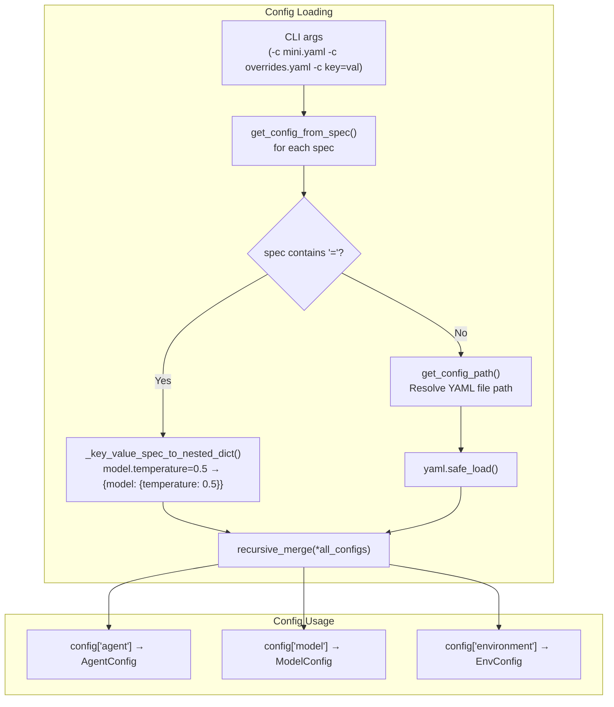

# TDD Guide: Config Loading in Go — Phase 12

This guide walks through implementing YAML config loading in Go using strict TDD (red-green-refactor). Each step builds on the previous one. Complete them in order.

This is the natural successor to [tdd_local_environment_go.md](file:///home/rvald/mini-swe-agent/docs/tdd_local_environment_go.md). By the end, you'll be able to load a YAML config file, merge multiple configs, and feed the results into `AgentConfig`, model config, and `LocalEnvironmentConfig`.

> [!IMPORTANT]
> **Source of truth:** Always refer back to [config/__init__.py](file:///home/rvald/mini-swe-agent/src/minisweagent/config/__init__.py), [default.yaml](file:///home/rvald/mini-swe-agent/src/minisweagent/config/default.yaml), and [mini.py](file:///home/rvald/mini-swe-agent/src/minisweagent/run/mini.py) when in doubt about behavior.

---

## How the Python Config System Works (Reference)

Before writing any code, internalize this data flow:



### Key Python Components

| Python Component | What it does | Go equivalent |
|---|---|---|
| `get_config_path(spec)` | Resolves a config spec to a file path, searching multiple directories | `resolveConfigPath()` |
| `get_config_from_spec(spec)` | Returns parsed YAML dict or key-value nested dict | `getConfigFromSpec()` |
| `_key_value_spec_to_nested_dict(spec)` | Parses `a.b.c=val` → `{a: {b: {c: val}}}` | `keyValueToNestedMap()` |
| `recursive_merge(*dicts)` | Deep-merges multiple configs | Already implemented in `internal/utils/merge.go` |
| `default.yaml` | Default config with `agent`, `model`, `environment` sections | Embedded or file-based YAML |

### YAML Config Structure

The YAML config is a flat dict with three top-level keys:

```yaml
agent:
  system_template: "..."
  instance_template: "..."
  step_limit: 0
  cost_limit: 0.
environment:
  env:
    PAGER: cat
model:
  observation_template: "..."
  model_kwargs:
    drop_params: true
```

Each section maps to a specific config struct in Go.

---

## File Structure

```
internal/config/
├── config.go          # Config loading logic
├── config_test.go     # All tests (white-box)
└── testdata/          # Test YAML files
    ├── minimal.yaml
    ├── override.yaml
    └── invalid.yaml
```

At the top of every file:

```go
package config
```

> [!NOTE]
> **Dependencies.** This package imports `internal/utils` for `recursiveMerge`, but does NOT import `internal/agent` or `internal/environment`. Config loading produces raw `map[string]any` dicts — the caller (CLI or main) is responsible for mapping them to typed structs. This keeps the config package decoupled.

---

## Phase 1: Raw Config Struct

### Step 1.1 — RawConfig Type

The top-level config is a map with three known sections. We use a typed struct for the top level, but `map[string]any` for the section contents (since each section is consumed by a different package).

**🔴 RED** — In `config_test.go`:

```go
func TestRawConfigSections(t *testing.T) {
    cfg := RawConfig{
        Agent:       map[string]any{"system_template": "hello"},
        Model:       map[string]any{"model_name": "gpt-4"},
        Environment: map[string]any{"timeout": 30},
    }
    if cfg.Agent["system_template"] != "hello" {
        t.Errorf("Agent system_template = %v, want 'hello'", cfg.Agent["system_template"])
    }
    if cfg.Model["model_name"] != "gpt-4" {
        t.Errorf("Model model_name = %v, want 'gpt-4'", cfg.Model["model_name"])
    }
    if cfg.Environment["timeout"] != 30 {
        t.Errorf("Environment timeout = %v, want 30", cfg.Environment["timeout"])
    }
}
```

**🟢 GREEN** — In `config.go`:

```go
type RawConfig struct {
    Agent       map[string]any `yaml:"agent"`
    Model       map[string]any `yaml:"model"`
    Environment map[string]any `yaml:"environment"`
}
```

**🔄 REFACTOR** — Nothing yet.

---

## Phase 2: YAML Parsing

### Step 2.1 — Load a Minimal YAML File

**What Python does:** `yaml.safe_load(path.read_text())` reads a YAML file into a dict.

In Go, use `gopkg.in/yaml.v3` or `github.com/goccy/go-yaml`. The YAML library unmarshals into `map[string]any`.

**🔴 RED:**

Create `testdata/minimal.yaml`:
```yaml
agent:
  system_template: "You are a test agent."
  instance_template: "Do: {{.Task}}"
environment:
  timeout: 10
```

```go
func TestLoadConfigFromYAML(t *testing.T) {
    cfg, err := LoadConfigFile("testdata/minimal.yaml")
    if err != nil {
        t.Fatalf("unexpected error: %v", err)
    }
    if cfg.Agent["system_template"] != "You are a test agent." {
        t.Errorf("system_template = %v, want 'You are a test agent.'", cfg.Agent["system_template"])
    }
    if cfg.Agent["instance_template"] != "Do: {{.Task}}" {
        t.Errorf("instance_template = %v, want 'Do: {{.Task}}'", cfg.Agent["instance_template"])
    }
    if cfg.Environment["timeout"] != 10 {
        t.Errorf("timeout = %v, want 10", cfg.Environment["timeout"])
    }
}
```

**🟢 GREEN:**

```go
import (
    "fmt"
    "os"

    "gopkg.in/yaml.v3"
)

func LoadConfigFile(path string) (RawConfig, error) {
    data, err := os.ReadFile(path)
    if err != nil {
        return RawConfig{}, fmt.Errorf("reading config file: %w", err)
    }
    return ParseConfigBytes(data)
}

func ParseConfigBytes(data []byte) (RawConfig, error) {
    var raw map[string]any
    if err := yaml.Unmarshal(data, &raw); err != nil {
        return RawConfig{}, fmt.Errorf("parsing YAML: %w", err)
    }
    cfg := RawConfig{
        Agent:       toStringAnyMap(raw["agent"]),
        Model:       toStringAnyMap(raw["model"]),
        Environment: toStringAnyMap(raw["environment"]),
    }
    return cfg, nil
}

func toStringAnyMap(v any) map[string]any {
    if v == nil {
        return make(map[string]any)
    }
    if m, ok := v.(map[string]any); ok {
        return m
    }
    return make(map[string]any)
}
```

> [!WARNING]
> **YAML library type quirks.** Different Go YAML libraries unmarshal differently. `gopkg.in/yaml.v3` unmarshals maps as `map[string]any` (good), but nested maps may come back as `map[string]any` or `map[any]any` depending on the version. Always test with nested structures. `github.com/goccy/go-yaml` consistently uses `map[string]any`.

---

### Step 2.2 — Missing File Returns Error

**🔴 RED:**

```go
func TestLoadConfigFileMissing(t *testing.T) {
    _, err := LoadConfigFile("testdata/nonexistent.yaml")
    if err == nil {
        t.Error("expected error for missing file, got nil")
    }
}
```

**🟢 GREEN** — Already handled: `os.ReadFile` returns an error for missing files.

---

### Step 2.3 — Invalid YAML Returns Error

**🔴 RED:**

Create `testdata/invalid.yaml`:
```
this is not: [valid: yaml
```

```go
func TestLoadConfigFileInvalidYAML(t *testing.T) {
    _, err := LoadConfigFile("testdata/invalid.yaml")
    if err == nil {
        t.Error("expected error for invalid YAML, got nil")
    }
}
```

**🟢 GREEN** — Already handled: `yaml.Unmarshal` returns an error for invalid YAML.

---

### Step 2.4 — Empty Sections Default to Empty Maps

A config file may only have some sections. Missing sections should default to empty maps, not nil.

**🔴 RED:**

```go
func TestLoadConfigPartialSections(t *testing.T) {
    cfg, err := ParseConfigBytes([]byte("agent:\n  step_limit: 5\n"))
    if err != nil {
        t.Fatalf("unexpected error: %v", err)
    }
    if cfg.Agent["step_limit"] != 5 {
        t.Errorf("step_limit = %v, want 5", cfg.Agent["step_limit"])
    }
    // Missing sections should be empty maps, not nil
    if cfg.Model == nil {
        t.Error("Model should not be nil for missing section")
    }
    if cfg.Environment == nil {
        t.Error("Environment should not be nil for missing section")
    }
}
```

**🟢 GREEN** — Already handled: `toStringAnyMap(nil)` returns an initialized empty map.

---

## Phase 3: Key-Value Spec Parsing

### Step 3.1 — Simple key=value

**What Python does:**
```python
def _key_value_spec_to_nested_dict(config_spec: str) -> dict:
    key, value = config_spec.split("=", 1)
    keys = key.split(".")
    # builds nested dict from dotted key
```

**🔴 RED:**

```go
func TestKeyValueSimple(t *testing.T) {
    result, err := KeyValueToNestedMap("model.model_name=gpt-4")
    if err != nil {
        t.Fatalf("unexpected error: %v", err)
    }
    model, ok := result["model"].(map[string]any)
    if !ok {
        t.Fatal("model should be a map")
    }
    if model["model_name"] != "gpt-4" {
        t.Errorf("model_name = %v, want 'gpt-4'", model["model_name"])
    }
}
```

**🟢 GREEN:**

```go
func KeyValueToNestedMap(spec string) (map[string]any, error) {
    parts := strings.SplitN(spec, "=", 2)
    if len(parts) != 2 {
        return nil, fmt.Errorf("invalid key=value spec: %q", spec)
    }
    key, value := parts[0], parts[1]

    // Try to parse value as JSON (for numbers, booleans, etc.)
    var parsed any
    if err := json.Unmarshal([]byte(value), &parsed); err != nil {
        parsed = value // Keep as string if not valid JSON
    }

    keys := strings.Split(key, ".")
    result := make(map[string]any)
    current := result
    for _, k := range keys[:len(keys)-1] {
        next := make(map[string]any)
        current[k] = next
        current = next
    }
    current[keys[len(keys)-1]] = parsed
    return result, nil
}
```

---

### Step 3.2 — Deeply Nested Key

**🔴 RED:**

```go
func TestKeyValueDeeplyNested(t *testing.T) {
    result, err := KeyValueToNestedMap("model.model_kwargs.temperature=0.5")
    if err != nil {
        t.Fatalf("unexpected error: %v", err)
    }
    model := result["model"].(map[string]any)
    kwargs := model["model_kwargs"].(map[string]any)
    if kwargs["temperature"] != 0.5 {
        t.Errorf("temperature = %v, want 0.5", kwargs["temperature"])
    }
}
```

**🟢 GREEN** — Already handled: the loop creates nested maps for each dot-separated key segment.

---

### Step 3.3 — JSON Value Parsing

**Python behavior:** `json.loads(value)` tries to parse the value as JSON first. If it fails, it keeps the raw string. This means `temperature=0.5` yields `0.5` (float), `drop_params=true` yields `true` (bool), and `model_name=gpt-4` yields `"gpt-4"` (string).

**🔴 RED:**

```go
func TestKeyValueJSONParsing(t *testing.T) {
    tests := []struct {
        spec string
        key  string
        want any
    }{
        {"a.val=0.5", "val", 0.5},
        {"a.val=true", "val", true},
        {"a.val=42", "val", float64(42)}, // JSON numbers are float64
        {"a.val=hello", "val", "hello"},  // Not valid JSON, stays string
    }
    for _, tt := range tests {
        result, err := KeyValueToNestedMap(tt.spec)
        if err != nil {
            t.Fatalf("spec %q: unexpected error: %v", tt.spec, err)
        }
        inner := result["a"].(map[string]any)
        if inner[tt.key] != tt.want {
            t.Errorf("spec %q: %v = %v (%T), want %v (%T)",
                tt.spec, tt.key, inner[tt.key], inner[tt.key], tt.want, tt.want)
        }
    }
}
```

**🟢 GREEN** — Already handled: `json.Unmarshal` parses numbers and booleans, falls back to string.

---

### Step 3.4 — No Equals Sign Returns Error

**🔴 RED:**

```go
func TestKeyValueNoEquals(t *testing.T) {
    _, err := KeyValueToNestedMap("not_a_key_value")
    if err == nil {
        t.Error("expected error for spec without '=', got nil")
    }
}
```

**🟢 GREEN** — Already handled: `SplitN` produces only one part.

---

## Phase 4: Config Merging

### Step 4.1 — Merge Multiple Configs

**What Python does in `mini.py`:**
```python
configs = [get_config_from_spec(spec) for spec in config_spec]
config = recursive_merge(*configs)
```

Multiple config sources are merged, with later values overriding earlier ones. This uses `recursive_merge` which you've already implemented in `internal/utils/`.

**🔴 RED:**

Create `testdata/override.yaml`:
```yaml
agent:
  step_limit: 5
  cost_limit: 2.0
model:
  model_name: "claude-3"
```

```go
func TestMergeConfigs(t *testing.T) {
    base, err := LoadConfigFile("testdata/minimal.yaml")
    if err != nil {
        t.Fatalf("loading base: %v", err)
    }
    override, err := LoadConfigFile("testdata/override.yaml")
    if err != nil {
        t.Fatalf("loading override: %v", err)
    }

    merged := MergeConfigs(base, override)

    // Base values preserved
    if merged.Agent["system_template"] != "You are a test agent." {
        t.Errorf("system_template should come from base, got %v", merged.Agent["system_template"])
    }
    // Override values applied
    if merged.Agent["step_limit"] != 5 {
        t.Errorf("step_limit = %v, want 5 (from override)", merged.Agent["step_limit"])
    }
    if merged.Agent["cost_limit"] != 2.0 {
        t.Errorf("cost_limit = %v, want 2.0 (from override)", merged.Agent["cost_limit"])
    }
    // New section from override
    if merged.Model["model_name"] != "claude-3" {
        t.Errorf("model_name = %v, want 'claude-3'", merged.Model["model_name"])
    }
    // Untouched section from base
    if merged.Environment["timeout"] != 10 {
        t.Errorf("timeout = %v, want 10 (from base)", merged.Environment["timeout"])
    }
}
```

**🟢 GREEN:**

```go
func MergeConfigs(configs ...RawConfig) RawConfig {
    result := RawConfig{
        Agent:       make(map[string]any),
        Model:       make(map[string]any),
        Environment: make(map[string]any),
    }
    for _, cfg := range configs {
        result.Agent = utils.RecursiveMerge(result.Agent, cfg.Agent)
        result.Model = utils.RecursiveMerge(result.Model, cfg.Model)
        result.Environment = utils.RecursiveMerge(result.Environment, cfg.Environment)
    }
    return result
}
```

> [!NOTE]
> **`recursiveMerge` must be exported.** It's currently in `internal/utils/merge.go`. You may need to rename it to `RecursiveMerge` (capitalized) if it isn't already exported, since the `config` package now imports it.

---

### Step 4.2 — Merge Key-Value Overrides Into File Config

**Python behavior:** CLI key-value specs like `model.temperature=0.5` are merged on top of file-based configs.

**🔴 RED:**

```go
func TestMergeKeyValueWithFileConfig(t *testing.T) {
    base, err := LoadConfigFile("testdata/minimal.yaml")
    if err != nil {
        t.Fatalf("loading base: %v", err)
    }
    kvMap, err := KeyValueToNestedMap("agent.step_limit=10")
    if err != nil {
        t.Fatalf("parsing key-value: %v", err)
    }
    kvConfig, err := ParseRawMap(kvMap)
    if err != nil {
        t.Fatalf("converting to RawConfig: %v", err)
    }

    merged := MergeConfigs(base, kvConfig)
    if merged.Agent["step_limit"] != float64(10) {
        t.Errorf("step_limit = %v, want 10", merged.Agent["step_limit"])
    }
    // Other values preserved
    if merged.Agent["system_template"] != "You are a test agent." {
        t.Errorf("system_template should be preserved from base")
    }
}
```

**🟢 GREEN:**

```go
func ParseRawMap(m map[string]any) (RawConfig, error) {
    return RawConfig{
        Agent:       toStringAnyMap(m["agent"]),
        Model:       toStringAnyMap(m["model"]),
        Environment: toStringAnyMap(m["environment"]),
    }, nil
}
```

---

## Phase 5: Config Spec Resolution

### Step 5.1 — GetConfigFromSpec Dispatches Correctly

**What Python does:**
```python
def get_config_from_spec(config_spec: str | Path) -> dict:
    if isinstance(config_spec, str) and "=" in config_spec:
        return _key_value_spec_to_nested_dict(config_spec)
    path = get_config_path(config_spec)
    return yaml.safe_load(path.read_text())
```

It checks if the spec is a key=value pair or a file path.

**🔴 RED:**

```go
func TestGetConfigFromSpecFile(t *testing.T) {
    cfg, err := GetConfigFromSpec("testdata/minimal.yaml")
    if err != nil {
        t.Fatalf("unexpected error: %v", err)
    }
    if cfg.Agent["system_template"] != "You are a test agent." {
        t.Errorf("system_template = %v, want 'You are a test agent.'", cfg.Agent["system_template"])
    }
}

func TestGetConfigFromSpecKeyValue(t *testing.T) {
    cfg, err := GetConfigFromSpec("model.model_name=gpt-4")
    if err != nil {
        t.Fatalf("unexpected error: %v", err)
    }
    if cfg.Model["model_name"] != "gpt-4" {
        t.Errorf("model_name = %v, want 'gpt-4'", cfg.Model["model_name"])
    }
}
```

**🟢 GREEN:**

```go
func GetConfigFromSpec(spec string) (RawConfig, error) {
    if strings.Contains(spec, "=") {
        m, err := KeyValueToNestedMap(spec)
        if err != nil {
            return RawConfig{}, err
        }
        return ParseRawMap(m)
    }
    return LoadConfigFile(spec)
}
```

---

### Step 5.2 — Auto-Append .yaml Extension

**Python behavior:** `get_config_path` appends `.yaml` if the spec doesn't already have it.

**🔴 RED:**

```go
func TestGetConfigFromSpecAutoExtension(t *testing.T) {
    // Copy minimal.yaml so we can test without extension
    // This test assumes "testdata/minimal" resolves to "testdata/minimal.yaml"
    cfg, err := GetConfigFromSpec("testdata/minimal")
    if err != nil {
        t.Fatalf("should resolve 'minimal' to 'minimal.yaml': %v", err)
    }
    if cfg.Agent["system_template"] != "You are a test agent." {
        t.Errorf("system_template = %v, want 'You are a test agent.'", cfg.Agent["system_template"])
    }
}
```

**🟢 GREEN** — Update `LoadConfigFile` (or `GetConfigFromSpec`) to try appending `.yaml`:

```go
func resolveConfigPath(spec string) (string, error) {
    candidates := []string{spec}
    if !strings.HasSuffix(spec, ".yaml") && !strings.HasSuffix(spec, ".yml") {
        candidates = append(candidates, spec+".yaml", spec+".yml")
    }
    for _, candidate := range candidates {
        if _, err := os.Stat(candidate); err == nil {
            return candidate, nil
        }
    }
    return "", fmt.Errorf("config file not found: %q (tried: %v)", spec, candidates)
}
```

---

## Phase 6: Building Typed Configs

### Step 6.1 — Build AgentConfig from Raw Map

This step bridges the raw `map[string]any` to the typed `AgentConfig` struct from `internal/agent/`. The config package doesn't do this directly — the caller does. But we provide a helper.

**🔴 RED:**

```go
func TestBuildAgentConfig(t *testing.T) {
    raw := map[string]any{
        "system_template":   "You are a helper.",
        "instance_template": "Task: {{.Task}}",
        "step_limit":        5,
        "cost_limit":        2.0,
    }
    cfg, err := BuildAgentConfig(raw)
    if err != nil {
        t.Fatalf("unexpected error: %v", err)
    }
    if cfg.SystemTemplate != "You are a helper." {
        t.Errorf("SystemTemplate = %q, want 'You are a helper.'", cfg.SystemTemplate)
    }
    if cfg.StepLimit != 5 {
        t.Errorf("StepLimit = %d, want 5", cfg.StepLimit)
    }
    if cfg.CostLimit != 2.0 {
        t.Errorf("CostLimit = %f, want 2.0", cfg.CostLimit)
    }
}
```

> [!NOTE]
> **Marshal-Unmarshal roundtrip.** The simplest approach is to marshal the `map[string]any` to JSON/YAML, then unmarshal into the typed struct. This avoids manual field-by-field mapping and handles type coercion (e.g., YAML `int` → Go `int`).

**🟢 GREEN:**

```go
import "github.com/your-module/internal/agent"

func BuildAgentConfig(raw map[string]any) (agent.AgentConfig, error) {
    data, err := yaml.Marshal(raw)
    if err != nil {
        return agent.AgentConfig{}, fmt.Errorf("marshaling agent config: %w", err)
    }
    var cfg agent.AgentConfig
    if err := yaml.Unmarshal(data, &cfg); err != nil {
        return agent.AgentConfig{}, fmt.Errorf("unmarshaling agent config: %w", err)
    }
    return cfg, nil
}
```

> [!WARNING]
> **YAML struct tags required.** For this roundtrip to work, your `AgentConfig` must have `yaml:"..."` tags that match the YAML keys (e.g., `system_template`). You'll need to add these tags to the existing struct in `internal/agent/types.go`.

---

### Step 6.2 — Build LocalEnvironmentConfig from Raw Map

**🔴 RED:**

```go
func TestBuildEnvironmentConfig(t *testing.T) {
    raw := map[string]any{
        "timeout": 10,
        "env":     map[string]any{"PAGER": "cat"},
    }
    cfg, err := BuildEnvironmentConfig(raw)
    if err != nil {
        t.Fatalf("unexpected error: %v", err)
    }
    if cfg.Timeout != 10 {
        t.Errorf("Timeout = %d, want 10", cfg.Timeout)
    }
    if cfg.Env["PAGER"] != "cat" {
        t.Errorf("Env[PAGER] = %q, want 'cat'", cfg.Env["PAGER"])
    }
}
```

**🟢 GREEN:**

```go
import "github.com/your-module/internal/environment"

func BuildEnvironmentConfig(raw map[string]any) (environment.LocalEnvironmentConfig, error) {
    data, err := yaml.Marshal(raw)
    if err != nil {
        return environment.LocalEnvironmentConfig{}, fmt.Errorf("marshaling env config: %w", err)
    }
    var cfg environment.LocalEnvironmentConfig
    if err := yaml.Unmarshal(data, &cfg); err != nil {
        return environment.LocalEnvironmentConfig{}, fmt.Errorf("unmarshaling env config: %w", err)
    }
    return cfg, nil
}
```

---

### Step 6.3 — Validate Required Fields

**Python behavior:** The YAML must include `system_template` and `instance_template` at minimum. Without them, the agent can't render its initial messages.

**🔴 RED:**

```go
func TestBuildAgentConfigMissingRequired(t *testing.T) {
    raw := map[string]any{"step_limit": 5}
    cfg, err := BuildAgentConfig(raw)
    if err != nil {
        t.Fatalf("BuildAgentConfig itself shouldn't error (Go zero values are fine)")
    }
    err = ValidateAgentConfig(cfg)
    if err == nil {
        t.Error("expected validation error for missing system_template and instance_template")
    }
}
```

**🟢 GREEN:**

```go
func ValidateAgentConfig(cfg agent.AgentConfig) error {
    if cfg.SystemTemplate == "" {
        return fmt.Errorf("agent config: system_template is required")
    }
    if cfg.InstanceTemplate == "" {
        return fmt.Errorf("agent config: instance_template is required")
    }
    return nil
}
```

---

## Phase 7: Full Pipeline — LoadAndMerge

### Step 7.1 — End-to-End Config Loading

Combines everything: resolve specs → parse each → merge → return.

**🔴 RED:**

```go
func TestLoadAndMerge(t *testing.T) {
    specs := []string{
        "testdata/minimal.yaml",
        "testdata/override.yaml",
        "agent.cost_limit=5.0",
    }
    cfg, err := LoadAndMerge(specs)
    if err != nil {
        t.Fatalf("unexpected error: %v", err)
    }
    // From minimal.yaml
    if cfg.Agent["system_template"] != "You are a test agent." {
        t.Errorf("system_template from base, got %v", cfg.Agent["system_template"])
    }
    // From override.yaml
    if cfg.Agent["step_limit"] != 5 {
        t.Errorf("step_limit from override, got %v", cfg.Agent["step_limit"])
    }
    // From key-value spec (overrides override.yaml's cost_limit)
    if cfg.Agent["cost_limit"] != 5.0 {
        t.Errorf("cost_limit from kv spec, got %v", cfg.Agent["cost_limit"])
    }
    // Model from override.yaml
    if cfg.Model["model_name"] != "claude-3" {
        t.Errorf("model_name from override, got %v", cfg.Model["model_name"])
    }
}
```

**🟢 GREEN:**

```go
func LoadAndMerge(specs []string) (RawConfig, error) {
    var configs []RawConfig
    for _, spec := range specs {
        cfg, err := GetConfigFromSpec(spec)
        if err != nil {
            return RawConfig{}, fmt.Errorf("loading spec %q: %w", spec, err)
        }
        configs = append(configs, cfg)
    }
    return MergeConfigs(configs...), nil
}
```

---

## Phase 8: YAML Tag Alignment

### Step 8.1 — AgentConfig YAML Tags

For the marshal/unmarshal roundtrip to work, the existing structs need YAML tags that match the Python config keys.

**🔴 RED** — This test lives in `internal/agent/default_test.go` (or a new integration test):

```go
func TestAgentConfigYAMLRoundtrip(t *testing.T) {
    input := `
system_template: "hello"
instance_template: "world"
step_limit: 5
cost_limit: 2.0
output_path: "/tmp/out.json"
`
    var cfg AgentConfig
    if err := yaml.Unmarshal([]byte(input), &cfg); err != nil {
        t.Fatalf("unmarshal error: %v", err)
    }
    if cfg.SystemTemplate != "hello" {
        t.Errorf("SystemTemplate = %q, want 'hello'", cfg.SystemTemplate)
    }
    if cfg.StepLimit != 5 {
        t.Errorf("StepLimit = %d, want 5", cfg.StepLimit)
    }
}
```

**🟢 GREEN** — Update `AgentConfig` in `internal/agent/types.go`:

```go
type AgentConfig struct {
    SystemTemplate   string  `json:"system_template" yaml:"system_template"`
    InstanceTemplate string  `json:"instance_template" yaml:"instance_template"`
    StepLimit        int     `json:"step_limit" yaml:"step_limit"`
    CostLimit        float64 `json:"cost_limit" yaml:"cost_limit"`
    OutputPath       string  `json:"output_path" yaml:"output_path"`
}
```

### Step 8.2 — LocalEnvironmentConfig YAML Tags

**🔴 RED** — In `internal/environment/local_test.go`:

```go
func TestLocalEnvironmentConfigYAMLRoundtrip(t *testing.T) {
    input := `
cwd: "/tmp"
timeout: 10
env:
  PAGER: cat
`
    var cfg LocalEnvironmentConfig
    if err := yaml.Unmarshal([]byte(input), &cfg); err != nil {
        t.Fatalf("unmarshal error: %v", err)
    }
    if cfg.Cwd != "/tmp" {
        t.Errorf("Cwd = %q, want '/tmp'", cfg.Cwd)
    }
    if cfg.Timeout != 10 {
        t.Errorf("Timeout = %d, want 10", cfg.Timeout)
    }
    if cfg.Env["PAGER"] != "cat" {
        t.Errorf("Env[PAGER] = %q, want 'cat'", cfg.Env["PAGER"])
    }
}
```

**🟢 GREEN** — Update `LocalEnvironmentConfig` in `internal/environment/types.go`:

```go
type LocalEnvironmentConfig struct {
    Cwd     string            `json:"cwd" yaml:"cwd"`
    Env     map[string]string `json:"env" yaml:"env"`
    Timeout int               `json:"timeout" yaml:"timeout"`
}
```

---

## Summary — Implementation Order

| Step | Test file | Production file | What you're proving |
|---|---|---|---|
| 1.1 | `TestRawConfigSections` | `config.go` | Top-level config struct exists |
| 2.1 | `TestLoadConfigFromYAML` | `config.go` | YAML file parsing works |
| 2.2 | `TestLoadConfigFileMissing` | — | Missing file returns error |
| 2.3 | `TestLoadConfigFileInvalidYAML` | — | Invalid YAML returns error |
| 2.4 | `TestLoadConfigPartialSections` | — | Missing sections → empty maps |
| 3.1 | `TestKeyValueSimple` | `config.go` | `key=value` parsing works |
| 3.2 | `TestKeyValueDeeplyNested` | — | Dotted keys create nested maps |
| 3.3 | `TestKeyValueJSONParsing` | — | Values parsed as typed JSON |
| 3.4 | `TestKeyValueNoEquals` | — | Invalid spec returns error |
| 4.1 | `TestMergeConfigs` | `config.go` | Multi-config merging works |
| 4.2 | `TestMergeKeyValueWithFileConfig` | `config.go` | File + CLI merge |
| 5.1 | `TestGetConfigFromSpec*` | `config.go` | Dispatcher routes correctly |
| 5.2 | `TestGetConfigFromSpecAutoExtension` | `config.go` | `.yaml` auto-appended |
| 6.1 | `TestBuildAgentConfig` | `config.go` | Raw map → typed `AgentConfig` |
| 6.2 | `TestBuildEnvironmentConfig` | `config.go` | Raw map → typed `LocalEnvironmentConfig` |
| 6.3 | `TestBuildAgentConfigMissingRequired` | `config.go` | Validation catches missing fields |
| 7.1 | `TestLoadAndMerge` | `config.go` | End-to-end pipeline |
| 8.1 | `TestAgentConfigYAMLRoundtrip` | `types.go` | YAML tags align with config keys |
| 8.2 | `TestLocalEnvironmentConfigYAMLRoundtrip` | `types.go` | YAML tags align with config keys |

---

## Refactoring Reminder

After completing all phases, consider these refactoring opportunities:

1. **Default config embedding** — Use Go's `embed` package to embed a `default.yaml` inside the binary, so the agent ships with sensible defaults without needing a file on disk.

2. **Config search paths** — The Python version searches multiple directories for config files (current dir, `MSWEA_CONFIG_DIR`, builtin dir). Add this to `resolveConfigPath` if needed.

3. **Model config struct** — Once you start Phase 13 (Concrete Model), you'll want a `ModelConfig` struct with its own YAML tags. The same marshal/unmarshal roundtrip pattern applies.
