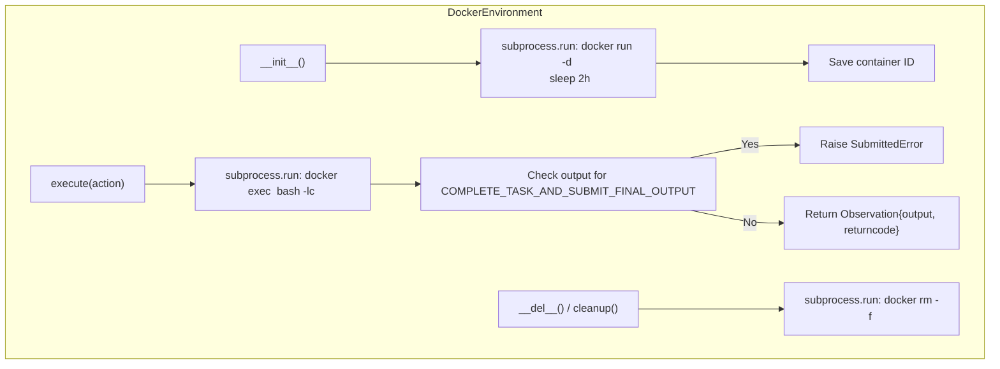

# TDD Guide: Docker Environment in Go — Phase 16

This guide walks through implementing a `DockerEnvironment` in Go using strict TDD (red-green-refactor). 

By the end of this phase, your agent will execute its bash commands safely inside an isolated Docker container rather than on your local machine, allowing it to work on real GitHub repositories without risking your host filesystem.

> [!IMPORTANT]
> **Source of truth:** Always refer back to [environments/docker.py](file:///home/rvald/mini-swe-agent/src/minisweagent/environments/docker.py) when in doubt about behavior.

---

## How the Python DockerEnvironment Works (Reference)



### Key Python Components

| Python Component | What it does | Go Equivalent |
|---|---|---|
| `DockerEnvironmentConfig` | Image, cwd, env vars to forward, pulled timeouts. | `DockerEnvironmentConfig` struct |
| `_start_container` | Boots a sleep process so the container stays alive. | `startContainer()` |
| `execute` | Injects environment flags (`-e VAR=val`) and runs `docker exec`. | `Execute(Action) Observation` |
| `_check_finished` | Identifies the submission sentinel and raises an error. | Re-use logic from Phase 11 (`LocalEnvironment`) |
| `cleanup` / `__del__` | Force-kills the container so they don't leak. | `Cleanup()` / Struct `Close()` method |

---

## File Structure

```
internal/environment/
├── docker.go          # DockerEnvironment implementation
└── docker_test.go     # Tests (requires Docker daemon to be running)
```

At the top of both files:
```go
package environment
```

> [!NOTE]
> **Testing Strategy:** Because this component explicitly interacts with the `docker` CLI, the unit tests will actually spin up real containers (e.g., `alpine` or `ubuntu`:latest). This means tests in `docker_test.go` will require Docker to be installed and running on the machine executing `go test`. You can use `t.Skip("Docker not running")` if `exec.LookPath("docker")` fails.

---

## Phase 1: Config and Container Lifecycle

### Step 1.1 — DockerEnvironmentConfig

**What it does:** Defines the image, startup arguments, and timeouts.

**🔴 RED** — In `docker_test.go`:

```go
func TestDockerConfigDefaults(t *testing.T) {
    cfg := DockerEnvironmentConfig{
        Image: "ubuntu:latest",
    }
    
    // We should have sensible defaults matching Python
    if cfg.Cwd != "" && cfg.Cwd != "/" {
        t.Errorf("Cwd = %q, want '/' or empty", cfg.Cwd)
    }
    if cfg.ContainerTimeout == "" {
        t.Errorf("expected default ContainerTimeout (e.g. '2h')")
    }
}
```

**🟢 GREEN** — In `docker.go`:

```go
type DockerEnvironmentConfig struct {
    Image            string            `json:"image" yaml:"image"`
    Cwd              string            `json:"cwd" yaml:"cwd"` 
    Env              map[string]string `json:"env" yaml:"env"`
    ForwardEnv       []string          `json:"forward_env" yaml:"forward_env"`
    Timeout          int               `json:"timeout" yaml:"timeout"`                     // cmd timeout
    Executable       string            `json:"executable" yaml:"executable"`               // default "docker"
    RunArgs          []string          `json:"run_args" yaml:"run_args"`                   // default ["--rm"]
    ContainerTimeout string            `json:"container_timeout" yaml:"container_timeout"` // default "2h"
    PullTimeout      int               `json:"pull_timeout" yaml:"pull_timeout"`           // default 120s
    Interpreter      []string          `json:"interpreter" yaml:"interpreter"`             // default ["bash", "-lc"]
}

// Helper to fill defaults if missing
func (c *DockerEnvironmentConfig) ApplyDefaults() {
    if c.Cwd == "" {
        c.Cwd = "/"
    }
    if c.Executable == "" {
        c.Executable = "docker"
    }
    if c.ContainerTimeout == "" {
        c.ContainerTimeout = "2h"
    }
    if c.PullTimeout == 0 {
        c.PullTimeout = 120
    }
    if len(c.RunArgs) == 0 {
        c.RunArgs = []string{"--rm"}
    }
    if len(c.Interpreter) == 0 {
        c.Interpreter = []string{"bash", "-lc"}
    }
}
```

---

### Step 1.2 — Starting and Cleaning Up (`docker run` / `docker rm`)

**What Python does:** Generates a random name `minisweagent-<uuid>`, runs `docker run -d --name <name> -w <cwd> --rm <image> sleep 2h`, and parses stdout to get the container ID. `cleanup()` force kills it.

**🔴 RED:**

```go
func TestDockerLifecycle(t *testing.T) {
    // Skip if docker isn't installed
    if _, err := exec.LookPath("docker"); err != nil {
        t.Skip("Docker executable not found, skipping TestDockerLifecycle")
    }

    cfg := DockerEnvironmentConfig{Image: "alpine:latest"}
    cfg.ApplyDefaults()
    // Override interpreter for alpine which uses sh, not bash
    cfg.Interpreter = []string{"sh", "-c"} 
    
    env, err := NewDockerEnvironment(cfg)
    if err != nil {
        t.Fatalf("failed to create environment: %v", err)
    }
    defer env.Cleanup()

    if env.ContainerID == "" {
        t.Fatalf("expected a ContainerID to be populated")
    }

    // Verify container is actually running
    out, err := exec.Command("docker", "ps", "-q", "-f", "id="+env.ContainerID).Output()
    if err != nil || strings.TrimSpace(string(out)) != env.ContainerID {
        t.Errorf("container %s is not running", env.ContainerID)
    }

    // Test cleanup
    env.Cleanup()
    out, _ = exec.Command("docker", "ps", "-q", "-f", "id="+env.ContainerID).Output()
    if strings.TrimSpace(string(out)) == env.ContainerID {
        t.Errorf("container %s was not killed during cleanup", env.ContainerID)
    }
}
```

**🟢 GREEN:**

```go
import (
    "bytes"
    "context"
    "fmt"
    "os/exec"
    "strings"
    "time"
    "github.com/google/uuid"
)

type DockerEnvironment struct {
    Config      DockerEnvironmentConfig
    ContainerID string
}

func NewDockerEnvironment(cfg DockerEnvironmentConfig) (*DockerEnvironment, error) {
    cfg.ApplyDefaults()
    env := &DockerEnvironment{Config: cfg}
    
    if err := env.startContainer(); err != nil {
        return nil, err
    }
    return env, nil
}

func (e *DockerEnvironment) startContainer() error {
    containerName := fmt.Sprintf("minisweagent-%s", uuid.New().String()[:8])
    
    args := []string{
        "run", "-d", "--name", containerName, "-w", e.Config.Cwd,
    }
    args = append(args, e.Config.RunArgs...)
    args = append(args, e.Config.Image, "sleep", e.Config.ContainerTimeout)

    ctx, cancel := context.WithTimeout(context.Background(), time.Duration(e.Config.PullTimeout)*time.Second)
    defer cancel()

    cmd := exec.CommandContext(ctx, e.Config.Executable, args...)
    
    var outBuf, errBuf bytes.Buffer
    cmd.Stdout = &outBuf
    cmd.Stderr = &errBuf

    if err := cmd.Run(); err != nil {
        return fmt.Errorf("starting container failed: %v\nstderr: %s", err, errBuf.String())
    }

    e.ContainerID = strings.TrimSpace(outBuf.String())
    return nil
}

func (e *DockerEnvironment) Cleanup() {
    if e.ContainerID == "" {
        return
    }
    // "docker rm -f <id>"
    cmd := exec.Command(e.Config.Executable, "rm", "-f", e.ContainerID)
    _ = cmd.Run() // Best effort
    e.ContainerID = ""
}
```

---

## Phase 2: Execution

### Step 2.1 — Happy Path (`docker exec`)

**What Python does:** `docker exec -w <cwd> -e <env> <id> bash -lc <command>`

**🔴 RED:**

```go
func TestDockerExecuteHappyPath(t *testing.T) {
    if _, err := exec.LookPath("docker"); err != nil { t.Skip() }

    cfg := DockerEnvironmentConfig{
        Image: "alpine:latest",
        Interpreter: []string{"sh", "-c"},
    }
    env, _ := NewDockerEnvironment(cfg)
    defer env.Cleanup()

    action := agent.Action{Command: "echo 'hello from docker'"}
    obs, err := env.Execute(action)

    if err != nil {
        t.Fatalf("unexpected Execute error: %v", err)
    }
    if obs.ReturnCode != 0 {
        t.Errorf("ReturnCode = %d, want 0", obs.ReturnCode)
    }
    if !strings.Contains(obs.Output, "hello from docker") {
        t.Errorf("Output = %q", obs.Output)
    }
}
```

**🟢 GREEN:**

```go
func (e *DockerEnvironment) Execute(action agent.Action) (agent.Observation, error) {
    if e.ContainerID == "" {
        return agent.Observation{ReturnCode: -1, ExceptionInfo: "Container not started"}, nil
    }

    args := []string{"exec", "-w", e.Config.Cwd}
    
    // Note: To fully match Python, read e.Config.ForwardEnv from os.Getenv and append -e flags
    for k, v := range e.Config.Env {
        args = append(args, "-e", fmt.Sprintf("%s=%s", k, v))
    }

    args = append(args, e.ContainerID)
    args = append(args, e.Config.Interpreter...)
    args = append(args, action.Command)

    // Using configured execution timeout (or a large default like 30s)
    timeout := e.Config.Timeout
    if timeout <= 0 {
        timeout = 30
    }
    ctx, cancel := context.WithTimeout(context.Background(), time.Duration(timeout)*time.Second)
    defer cancel()

    cmd := exec.CommandContext(ctx, e.Config.Executable, args...)
    
    // Combine stdout and stderr just like Python does with subprocess.STDOUT
    out, err := cmd.CombinedOutput()
    
    outputStr := string(out)
    obs := agent.Observation{
        Output: outputStr,
    }

    if err != nil {
        // If context deadline exceeded, flag it
        if ctx.Err() == context.DeadlineExceeded {
            obs.ReturnCode = -1
            obs.ExceptionInfo = "Command timed out"
            return obs, nil
        }
        
        // Try to get exit code
        if exitErr, ok := err.(*exec.ExitError); ok {
            obs.ReturnCode = exitErr.ExitCode()
        } else {
            obs.ReturnCode = -1
            obs.ExceptionInfo = err.Error()
        }
    } else {
        obs.ReturnCode = 0
    }

    // Step 2.2 will go here (checker for COMPLETE_TASK...)

    return obs, nil
}
```

---

### Step 2.2 — Task Sentinel Detection (`SubmittedError`)

Reusing the logic you already built for `LocalEnvironment` in Phase 11.

**🔴 RED:**

```go
func TestDockerExecuteSubmitted(t *testing.T) {
    if _, err := exec.LookPath("docker"); err != nil { t.Skip() }

    cfg := DockerEnvironmentConfig{Image: "alpine:latest", Interpreter: []string{"sh", "-c"}}
    env, _ := NewDockerEnvironment(cfg)
    defer env.Cleanup()

    action := agent.Action{Command: "echo 'COMPLETE_TASK_AND_SUBMIT_FINAL_OUTPUT\nmy fix'"}
    
    // Execute returns (Observation, error). The error should be a *SubmittedError
    _, err := env.Execute(action)

    var subErr *agent.SubmittedError
    if !errors.As(err, &subErr) {
        t.Fatalf("expected SubmittedError, got %v", err)
    }

    // Check that the payload was extracted correctly
    submission, ok := subErr.Messages[0].Extra["submission"].(string)
    if !ok || strings.TrimSpace(submission) != "my fix" {
        t.Errorf("submission payload = %q", submission)
    }
}
```

**🟢 GREEN:**

Add this before returning the observation in `Execute()`:

```go
    // Parse output lines just like in LocalEnvironment
    lines := strings.Split(strings.TrimLeft(outputStr, " \t\r\n"), "\n")
    if len(lines) > 0 && strings.TrimSpace(lines[0]) == "COMPLETE_TASK_AND_SUBMIT_FINAL_OUTPUT" && obs.ReturnCode == 0 {
        submission := strings.Join(lines[1:], "\n")
        msg := agent.Message{
            Role:    "exit",
            Content: submission,
            Extra: map[string]any{
                "exit_status": "Submitted",
                "submission":  submission,
            },
        }
        return obs, &agent.SubmittedError{
            InterruptAgentFlowError: agent.InterruptAgentFlowError{
                Messages: []agent.Message{msg},
            },
        }
    }
```

---

## Phase 3: Wiring it Contextually (Optional)

If your Go entrypoint handles OS shutdowns, ensure `Cleanup()` runs before `os.Exit()`.

```go
// In cmd/mini/main.go
env, _ := environment.NewDockerEnvironment(cfg)
defer env.Cleanup()

// Trap signals
c := make(chan os.Signal, 1)
signal.Notify(c, os.Interrupt, syscall.SIGTERM)
go func() {
    <-c
    env.Cleanup()
    os.Exit(1)
}()
```

## Summary — Implementation Order

| Step | Test file | Production file | What you're proving |
|---|---|---|---|
| 1.1 | `TestDockerConfigDefaults` | `docker.go` | Data structs maps Python params |
| 1.2 | `TestDockerLifecycle` | `docker.go` | `run -d sleep` boots container, `rm -f` destroys it |
| 2.1 | `TestDockerExecuteHappyPath` | `docker.go` | `exec` routes command inside the container |
| 2.2 | `TestDockerExecuteSubmitted` | `docker.go` | Agent completion sentinel is caught via `SubmittedError` |
