# TDD Guide: Porting DefaultAgent to Go

This guide walks through porting the Python `DefaultAgent` to Go using strict TDD (red-green-refactor). Each step builds on the previous one. Complete them in order.

> [!IMPORTANT]
> **Source of truth:** Always refer back to [default.py](file:///home/rvald/mini-swe-agent/src/minisweagent/agents/default.py) and [control_flow.md](file:///home/rvald/mini-swe-agent/docs/advanced/control_flow.md) when in doubt about behavior.

---

## How the Python DefaultAgent Works (Reference)

Before writing any code, internalize this control flow. Every test step maps to a piece of it.

```mermaid
flowchart TD
    subgraph run["Agent.run(task)"]
        A["Initialize messages<br/>(system + user from templates)"] --> B["Agent.step()"]
        B --> C{"InterruptAgentFlow<br/>exception?"}
        C -->|"Yes (Submitted, LimitsExceeded, FormatError)"| D["Add exception's messages<br/>to trajectory"]
        C -->|"No"| E
        C -->|"Other exception"| F["handle_uncaught_exception<br/>(add exit message, re-raise)"]
        D --> E{"messages[-1].role == exit?"}
        E -->|No| B
        E -->|Yes| G["Return messages[-1].extra"]
    end

    subgraph step["Agent.step()"]
        S1["Agent.query()"] --> S2["Agent.execute_actions()"]
    end

    subgraph query["Agent.query()"]
        Q0{"step_limit or cost_limit<br/>exceeded?"} -->|Yes| Q1["raise LimitsExceeded"]
        Q0 -->|No| Q2["n_calls++"]
        Q2 --> Q3["Model.query(messages)"]
        Q3 --> Q4["cost += message.extra.cost"]
        Q4 --> Q5["add_messages(message)"]
    end

    subgraph exec["Agent.execute_actions(message)"]
        E1["for action in message.extra.actions:<br/>env.execute(action)"] --> E2["Model.format_observation_messages()"]
        E2 --> E3["add_messages(observations)"]
    end
```



### Key Python Components

| Python Component | What it does | Go equivalent |
|---|---|---|
| `AgentConfig` (Pydantic BaseModel) | Holds `system_template`, `instance_template`, `step_limit`, `cost_limit`, `output_path` | Go struct with field tags |
| `DefaultAgent.__init__` | Stores model, env, config; initializes `messages=[]`, `cost=0.0`, `n_calls=0` | `NewDefaultAgent()` constructor |
| `_render_template` | Jinja2 template rendering with `StrictUndefined` | `text/template` with strict mode |
| `add_messages` | Appends messages to `self.messages`, returns them | Method on agent struct |
| `query` | Checks limits → calls `model.query` → tracks cost → appends message | Method on agent struct |
| `execute_actions` | Calls `env.execute` per action → formats observations → appends | Method on agent struct |
| `run` | Init messages → loop `step()` → catch `InterruptAgentFlow` → save → check exit | Method on agent struct |
| `serialize` / `save` | Builds nested dict with info/messages → writes JSON | Method on agent struct |
| `InterruptAgentFlow` | Exception hierarchy carrying messages (Submitted, LimitsExceeded, FormatError) | Custom error types |
| `recursive_merge` | Deep-merges dicts, later values win | Utility function |
| `Model` protocol | `query`, `format_message`, `format_observation_messages`, `get_template_vars`, `serialize` | Go interface |
| `Environment` protocol | `execute`, `get_template_vars`, `serialize` | Go interface |

---

## Phase 0: Project Setup

### File structure

```
internal/agent/
├── types.go           # Structs + interfaces
├── errors.go          # Custom error types
├── merge.go           # recursive_merge utility
├── default.go         # DefaultAgent logic
└── default_test.go    # All tests (white-box)
```

At the top of every file:

```go
package agent
```

Use `package agent` (white-box) for tests — we need access to unexported helpers like `renderTemplate`.

---

## Phase 1: Domain Types

### Step 1.1 — AgentConfig

**What it is in Python:**
```python
class AgentConfig(BaseModel):
    system_template: str           # Required, no default
    instance_template: str         # Required, no default
    step_limit: int = 0            # 0 means unlimited
    cost_limit: float = 3.0        # Stop after exceeding this
    output_path: Path | None = None
```

**🔴 RED** — In `default_test.go`, write:

```go
func TestAgentConfigDefaults(t *testing.T) {
    cfg := AgentConfig{
        SystemTemplate:   "You are a helper.",
        InstanceTemplate: "Task: {{.Task}}",
    }
    if cfg.SystemTemplate != "You are a helper." {
        t.Errorf("SystemTemplate = %q, want %q", cfg.SystemTemplate, "You are a helper.")
    }
    if cfg.StepLimit != 0 {
        t.Errorf("StepLimit = %d, want 0", cfg.StepLimit)
    }
    if cfg.CostLimit != 0 {
        t.Errorf("CostLimit = %f, want 0", cfg.CostLimit)
    }
    if cfg.OutputPath != "" {
        t.Errorf("OutputPath = %q, want empty", cfg.OutputPath)
    }
}
```

> [!NOTE]
> **Go doesn't have default values on struct fields.** In Python, `cost_limit: float = 3.0` gives a default. In Go, a `float64` field zero-values to `0.0`. If we want a nonzero default, we'd set it in the constructor. For now, keep it simple: the zero value of `0` means "unlimited" (matching Python's `step_limit: int = 0` semantics). We'll handle the `cost_limit` default in the constructor later.

**🟢 GREEN** — In `types.go`:

```go
type AgentConfig struct {
    SystemTemplate   string
    InstanceTemplate string
    StepLimit        int
    CostLimit        float64
    OutputPath       string
}
```

**🔄 REFACTOR** — Nothing yet. Move on.

---

### Step 1.2 — Message

**What it is in Python:** Messages are plain `dict`s with keys `role`, `content`, and an optional `extra` dict that carries `actions`, `cost`, `exit_status`, `submission`, etc.

```python
# Example messages in the trajectory:
{"role": "system", "content": "You are a helper."}
{"role": "assistant", "content": "Thinking...", "extra": {"actions": [{"command": "echo hi"}], "cost": 0.5}}
{"role": "tool", "content": "<output>hi</output>", "extra": {"returncode": 0}}
{"role": "exit", "content": "done", "extra": {"exit_status": "Submitted", "submission": "done"}}
```

**🔴 RED:**

```go
func TestMessageStructure(t *testing.T) {
    msg := Message{Role: "assistant", Content: "thinking"}
    if msg.Role != "assistant" {
        t.Errorf("Role = %q, want %q", msg.Role, "assistant")
    }
    if msg.Content != "thinking" {
        t.Errorf("Content = %q, want %q", msg.Content, "thinking")
    }
    // Extra should be usable for arbitrary metadata
    msg.Extra = map[string]any{"cost": 0.5}
    cost, ok := msg.Extra["cost"].(float64)
    if !ok || cost != 0.5 {
        t.Errorf("Extra cost = %v, want 0.5", msg.Extra["cost"])
    }
}
```

**🟢 GREEN:**

```go
type Message struct {
    Role    string         `json:"role"`
    Content string         `json:"content"`
    Extra   map[string]any `json:"extra,omitempty"`
}
```

> [!TIP]
> **Why `map[string]any` for Extra?** The Python code uses `dict` for everything — `extra` carries `actions`, `cost`, `exit_status`, `submission`, `timestamp`, etc. A typed struct would be cleaner long-term, but starting with `map[string]any` mirrors the Python behavior exactly. You can refactor to a typed `MessageExtra` struct later once you see all the patterns.

---

### Step 1.3 — Action and Observation

**What they are in Python:**
- An `Action` is a dict like `{"command": "echo hi", "tool_call_id": "call_0"}` — extracted from the model's response.
- An `Observation` is a dict like `{"output": "hi\n", "returncode": 0, "exception_info": ""}` — returned by the environment.

**🔴 RED:**

```go
func TestActionAndObservation(t *testing.T) {
    action := Action{Command: "echo hello", ToolCallID: "call_0"}
    if action.Command != "echo hello" {
        t.Errorf("Command = %q, want %q", action.Command, "echo hello")
    }

    obs := Observation{Output: "hello\n", ReturnCode: 0}
    if obs.Output != "hello\n" {
        t.Errorf("Output = %q, want %q", obs.Output, "hello\n")
    }
    if obs.ReturnCode != 0 {
        t.Errorf("ReturnCode = %d, want 0", obs.ReturnCode)
    }
    if obs.ExceptionInfo != "" {
        t.Errorf("ExceptionInfo = %q, want empty", obs.ExceptionInfo)
    }
}
```

**🟢 GREEN:**

```go
type Action struct {
    Command    string `json:"command"`
    ToolCallID string `json:"tool_call_id,omitempty"`
}

type Observation struct {
    Output        string `json:"output"`
    ReturnCode    int    `json:"returncode"`
    ExceptionInfo string `json:"exception_info"`
}
```

---

## Phase 2: Interfaces

### Step 2.1 — Model and Environment Interfaces

**What they are in Python** (from `__init__.py` protocols):

```python
class Model(Protocol):
    def query(self, messages: list[dict]) -> dict: ...
    def format_message(self, **kwargs) -> dict: ...
    def format_observation_messages(self, message: dict, outputs: list[dict], template_vars: dict | None) -> list[dict]: ...
    def get_template_vars(self, **kwargs) -> dict: ...
    def serialize(self) -> dict: ...

class Environment(Protocol):
    def execute(self, action: dict, cwd: str = "") -> dict: ...
    def get_template_vars(self, **kwargs) -> dict: ...
    def serialize(self) -> dict: ...
```

**🔴 RED — Write a test that uses mock implementations of both interfaces:**

```go
func TestMockModelSatisfiesInterface(t *testing.T) {
    var m Model = &MockModel{}
    if m == nil {
        t.Fatal("MockModel should satisfy Model interface")
    }
}

func TestMockEnvSatisfiesInterface(t *testing.T) {
    var e Environment = &MockEnv{}
    if e == nil {
        t.Fatal("MockEnv should satisfy Environment interface")
    }
}
```

This won't compile because `Model`, `Environment`, `MockModel`, and `MockEnv` don't exist.

**🟢 GREEN** — In `types.go`, define the interfaces:

```go
type Model interface {
    Query(messages []Message) (Message, error)
    FormatMessage(role, content string, extra map[string]any) Message
    FormatObservationMessages(message Message, outputs []Observation) []Message
    GetTemplateVars() map[string]any
    Serialize() map[string]any
}

type Environment interface {
    Execute(action Action) (Observation, error)
    GetTemplateVars() map[string]any
    Serialize() map[string]any
}
```

Then in `default_test.go`, create minimal mocks:

```go
type MockModel struct {
    Responses []Message
    CallCount int
}

func (m *MockModel) Query(messages []Message) (Message, error) {
    if m.CallCount >= len(m.Responses) {
        return Message{}, fmt.Errorf("no more responses")
    }
    resp := m.Responses[m.CallCount]
    m.CallCount++
    return resp, nil
}

func (m *MockModel) FormatMessage(role, content string, extra map[string]any) Message {
    return Message{Role: role, Content: content, Extra: extra}
}

func (m *MockModel) FormatObservationMessages(message Message, outputs []Observation) []Message {
    var msgs []Message
    for _, obs := range outputs {
        msgs = append(msgs, Message{
            Role: "tool",
            Content: fmt.Sprintf("<returncode>%d</returncode>\n<output>\n%s</output>", obs.ReturnCode, obs.Output),
            Extra: map[string]any{"returncode": obs.ReturnCode},
        })
    }
    return msgs
}

func (m *MockModel) GetTemplateVars() map[string]any { return nil }
func (m *MockModel) Serialize() map[string]any       { return nil }

// ---

type MockEnv struct {
    Outputs   []Observation
    CallCount int
}

func (e *MockEnv) Execute(action Action) (Observation, error) {
    if e.CallCount >= len(e.Outputs) {
        return Observation{}, fmt.Errorf("no more outputs")
    }
    obs := e.Outputs[e.CallCount]
    e.CallCount++
    return obs, nil
}

func (e *MockEnv) GetTemplateVars() map[string]any { return nil }
func (e *MockEnv) Serialize() map[string]any       { return nil }
```

> [!NOTE]
> **Go interfaces are satisfied implicitly.** There's no `implements` keyword. If `MockModel` has all the methods that `Model` requires, then `var m Model = &MockModel{}` compiles. If you forget a method, the compiler tells you exactly which one is missing. The test's `var m Model = &MockModel{}` line IS the assertion — compilation failure IS the red phase.

---

## Phase 3: Error Types

### Step 3.1 — InterruptAgentFlow and Its Children

**What it is in Python:**
```python
class InterruptAgentFlow(Exception):
    def __init__(self, *messages: dict):
        self.messages = messages

class Submitted(InterruptAgentFlow): ...
class LimitsExceeded(InterruptAgentFlow): ...
class FormatError(InterruptAgentFlow): ...
```

These exceptions carry messages. The `run()` loop catches `InterruptAgentFlow`, appends all carried messages to the trajectory, and continues. If the last message has `role == "exit"`, the loop breaks.

**🔴 RED:**

```go
func TestInterruptAgentFlowCarriesMessages(t *testing.T) {
    exitMsg := Message{Role: "exit", Content: "done", Extra: map[string]any{"exit_status": "Submitted"}}
    err := &SubmittedError{Messages: []Message{exitMsg}}

    // It should satisfy the error interface
    var e error = err
    if e.Error() == "" {
        t.Error("Error() should return a non-empty string")
    }

    // It should be detectable as an InterruptAgentFlow
    var flow *InterruptAgentFlowError
    if !errors.As(err, &flow) {
        t.Error("SubmittedError should be unwrappable as InterruptAgentFlowError")
    }
    if len(flow.Messages) != 1 {
        t.Errorf("Messages len = %d, want 1", len(flow.Messages))
    }
}

func TestLimitsExceededError(t *testing.T) {
    err := NewLimitsExceededError()

    var flow *InterruptAgentFlowError
    if !errors.As(err, &flow) {
        t.Error("LimitsExceededError should be unwrappable as InterruptAgentFlowError")
    }
    if flow.Messages[0].Role != "exit" {
        t.Errorf("Role = %q, want 'exit'", flow.Messages[0].Role)
    }
    if flow.Messages[0].Extra["exit_status"] != "LimitsExceeded" {
        t.Error("exit_status should be LimitsExceeded")
    }
}
```

**🟢 GREEN** — In `errors.go`:

```go
// InterruptAgentFlowError is the base error type.
// Submitted, LimitsExceeded, and FormatError embed it.
type InterruptAgentFlowError struct {
    Messages []Message
}

func (e *InterruptAgentFlowError) Error() string {
    return "agent flow interrupted"
}

// SubmittedError — task is done.
type SubmittedError struct {
    InterruptAgentFlowError
}

// LimitsExceededError — step or cost limit hit.
type LimitsExceededError struct {
    InterruptAgentFlowError
}

func NewLimitsExceededError() *LimitsExceededError {
    return &LimitsExceededError{
        InterruptAgentFlowError: InterruptAgentFlowError{
            Messages: []Message{{
                Role:    "exit",
                Content: "LimitsExceeded",
                Extra:   map[string]any{"exit_status": "LimitsExceeded", "submission": ""},
            }},
        },
    }
}

// FormatError — LM output is malformed.
type FormatError struct {
    InterruptAgentFlowError
}
```

> [!IMPORTANT]
> **Why `errors.As` instead of type assertion?** Go's `errors.As` unwraps embedded errors. Because `SubmittedError` embeds `InterruptAgentFlowError`, using `errors.As(err, &flow)` will find the embedded struct. This mirrors Python's `except InterruptAgentFlow as e:` which catches all subclasses. The `run()` loop will use this same pattern.

---

## Phase 4: Utility — recursive_merge

### Step 4.1 — Deep Dict Merging

**What it does in Python** (from `utils/serialize.py`):
```python
def recursive_merge(*dictionaries) -> dict:
    # Later dicts override earlier ones
    # Nested dicts are merged recursively
```

This is used by `get_template_vars()` to merge config, env vars, model vars, and agent stats into one flat namespace for template rendering.

**🔴 RED:**

```go
func TestRecursiveMerge(t *testing.T) {
    a := map[string]any{"x": 1, "nested": map[string]any{"a": 1, "b": 2}}
    b := map[string]any{"y": 2, "nested": map[string]any{"b": 99, "c": 3}}
    result := recursiveMerge(a, b)

    if result["x"] != 1 {
        t.Errorf("x = %v, want 1", result["x"])
    }
    if result["y"] != 2 {
        t.Errorf("y = %v, want 2", result["y"])
    }
    nested := result["nested"].(map[string]any)
    if nested["a"] != 1 {
        t.Errorf("nested.a = %v, want 1", nested["a"])
    }
    if nested["b"] != 99 {
        t.Errorf("nested.b = %v, want 99 (later dict wins)", nested["b"])
    }
    if nested["c"] != 3 {
        t.Errorf("nested.c = %v, want 3", nested["c"])
    }
}

func TestRecursiveMergeNilSafe(t *testing.T) {
    result := recursiveMerge(nil, map[string]any{"a": 1}, nil)
    if result["a"] != 1 {
        t.Errorf("a = %v, want 1", result["a"])
    }
}
```

**🟢 GREEN** — In `merge.go`:

```go
func recursiveMerge(dicts ...map[string]any) map[string]any {
    result := make(map[string]any)
    for _, d := range dicts {
        if d == nil {
            continue
        }
        for k, v := range d {
            existing, exists := result[k]
            if exists {
                if existMap, ok := existing.(map[string]any); ok {
                    if vMap, ok2 := v.(map[string]any); ok2 {
                        result[k] = recursiveMerge(existMap, vMap)
                        continue
                    }
                }
            }
            result[k] = v
        }
    }
    return result
}
```

---

## Phase 5: Template Rendering

### Step 5.1 — renderTemplate

**What it does in Python:**
```python
def _render_template(self, template: str) -> str:
    return Template(template, undefined=StrictUndefined).render(**self.get_template_vars())
```

Jinja2's `StrictUndefined` causes an error if a template references a variable that doesn't exist. Go's `text/template` has a similar `Option("missingkey=error")`.

**🔴 RED:**

```go
func TestRenderTemplate(t *testing.T) {
    result, err := renderTemplate("Hello {{.Name}}", map[string]any{"Name": "World"})
    if err != nil {
        t.Fatalf("unexpected error: %v", err)
    }
    if result != "Hello World" {
        t.Errorf("result = %q, want %q", result, "Hello World")
    }
}

func TestRenderTemplateMissingVar(t *testing.T) {
    _, err := renderTemplate("Hello {{.Missing}}", map[string]any{"Name": "World"})
    if err == nil {
        t.Error("expected error for missing template variable, got nil")
    }
}
```

**🟢 GREEN** — In `default.go`:

```go
func renderTemplate(tmpl string, vars map[string]any) (string, error) {
    t, err := template.New("").Option("missingkey=error").Parse(tmpl)
    if err != nil {
        return "", fmt.Errorf("parsing template: %w", err)
    }
    var buf bytes.Buffer
    if err := t.Execute(&buf, vars); err != nil {
        return "", fmt.Errorf("executing template: %w", err)
    }
    return buf.String(), nil
}
```

> [!WARNING]
> **Jinja2 vs Go templates — syntax difference.** Jinja2 uses `{{ task }}` (bare variable name). Go uses `{{.Task}}` (dot prefix, PascalCase key). Your YAML config templates will need to be adapted. You can handle this later when wiring up the config loader, but keep it in mind.

---

## Phase 6: Constructor and add_messages

### Step 6.1 — NewDefaultAgent

**What Python `__init__` does:**
```python
self.config = config_class(**kwargs)   # Parse config
self.messages = []                      # Empty trajectory
self.model = model                      # Store model
self.env = env                          # Store environment
self.extra_template_vars = {}           # Extra vars for templates
self.cost = 0.0                         # Total API cost
self.n_calls = 0                        # Total API calls
```

**🔴 RED:**

```go
func TestNewDefaultAgent(t *testing.T) {
    cfg := AgentConfig{SystemTemplate: "sys", InstanceTemplate: "inst"}
    agent := NewDefaultAgent(cfg, &MockModel{}, &MockEnv{})

    if agent == nil {
        t.Fatal("agent should not be nil")
    }
    if len(agent.messages) != 0 {
        t.Errorf("messages len = %d, want 0", len(agent.messages))
    }
    if agent.cost != 0 {
        t.Errorf("cost = %f, want 0", agent.cost)
    }
    if agent.nCalls != 0 {
        t.Errorf("nCalls = %d, want 0", agent.nCalls)
    }
}
```

**🟢 GREEN** — In `default.go`:

```go
type DefaultAgent struct {
    config           AgentConfig
    model            Model
    env              Environment
    messages         []Message
    extraTemplateVars map[string]any
    cost             float64
    nCalls           int
}

func NewDefaultAgent(cfg AgentConfig, model Model, env Environment) *DefaultAgent {
    return &DefaultAgent{
        config:           cfg,
        model:            model,
        env:              env,
        messages:         []Message{},
        extraTemplateVars: make(map[string]any),
    }
}
```

---

### Step 6.2 — addMessages

**What it does in Python:**
```python
def add_messages(self, *messages: dict) -> list[dict]:
    self.messages.extend(messages)
    return list(messages)
```

Simple: append to trajectory, return what was added.

**🔴 RED:**

```go
func TestAddMessages(t *testing.T) {
    agent := NewDefaultAgent(AgentConfig{}, &MockModel{}, &MockEnv{})

    added := agent.addMessages(
        Message{Role: "system", Content: "hello"},
        Message{Role: "user", Content: "world"},
    )

    if len(agent.messages) != 2 {
        t.Errorf("messages len = %d, want 2", len(agent.messages))
    }
    if len(added) != 2 {
        t.Errorf("returned len = %d, want 2", len(added))
    }
    if agent.messages[0].Role != "system" {
        t.Errorf("messages[0].Role = %q, want 'system'", agent.messages[0].Role)
    }
}
```

**🟢 GREEN:**

```go
func (a *DefaultAgent) addMessages(msgs ...Message) []Message {
    a.messages = append(a.messages, msgs...)
    return msgs
}
```

---

## Phase 7: query()

### Step 7.1 — Happy Path Query

**What Python `query()` does:**
1. Check limits (step and cost) — raise `LimitsExceeded` if over
2. Increment `n_calls`
3. Call `model.query(self.messages)` to get a message
4. Accumulate cost from `message["extra"]["cost"]`
5. Append message to trajectory
6. Return the message

**🔴 RED:**

```go
func TestQueryHappyPath(t *testing.T) {
    model := &MockModel{
        Responses: []Message{{
            Role:    "assistant",
            Content: "I will run a command",
            Extra: map[string]any{
                "actions": []Action{{Command: "echo hi"}},
                "cost":    0.5,
            },
        }},
    }
    agent := NewDefaultAgent(AgentConfig{}, model, &MockEnv{})
    // Seed with initial messages (query expects some context)
    agent.addMessages(Message{Role: "system", Content: "sys"})

    msg, err := agent.query()
    if err != nil {
        t.Fatalf("unexpected error: %v", err)
    }
    if msg.Role != "assistant" {
        t.Errorf("Role = %q, want 'assistant'", msg.Role)
    }
    if agent.nCalls != 1 {
        t.Errorf("nCalls = %d, want 1", agent.nCalls)
    }
    if agent.cost != 0.5 {
        t.Errorf("cost = %f, want 0.5", agent.cost)
    }
    // Message should be in trajectory
    if len(agent.messages) != 2 { // system + assistant
        t.Errorf("messages len = %d, want 2", len(agent.messages))
    }
}
```

**🟢 GREEN** — In `default.go`:

```go
func (a *DefaultAgent) query() (Message, error) {
    // Check limits (0 means unlimited)
    if a.config.StepLimit > 0 && a.nCalls >= a.config.StepLimit {
        return Message{}, NewLimitsExceededError()
    }
    if a.config.CostLimit > 0 && a.cost >= a.config.CostLimit {
        return Message{}, NewLimitsExceededError()
    }

    a.nCalls++
    msg, err := a.model.Query(a.messages)
    if err != nil {
        return Message{}, err
    }

    // Track cost
    if cost, ok := msg.Extra["cost"].(float64); ok {
        a.cost += cost
    }

    a.addMessages(msg)
    return msg, nil
}
```

---

### Step 7.2 — Step Limit Enforcement

**Python behavior:** `if 0 < self.config.step_limit <= self.n_calls: raise LimitsExceeded(...)`

**🔴 RED:**

```go
func TestQueryStepLimitExceeded(t *testing.T) {
    model := &MockModel{Responses: []Message{
        {Role: "assistant", Content: "r1", Extra: map[string]any{"cost": 0.1}},
        {Role: "assistant", Content: "r2", Extra: map[string]any{"cost": 0.1}},
    }}
    agent := NewDefaultAgent(AgentConfig{StepLimit: 1}, model, &MockEnv{})
    agent.addMessages(Message{Role: "system", Content: "sys"})

    // First query should succeed
    _, err := agent.query()
    if err != nil {
        t.Fatalf("first query should succeed: %v", err)
    }

    // Second query should fail with LimitsExceeded
    _, err = agent.query()
    var limitsErr *LimitsExceededError
    if !errors.As(err, &limitsErr) {
        t.Errorf("expected LimitsExceededError, got %T: %v", err, err)
    }
    // Model should only have been called once
    if model.CallCount != 1 {
        t.Errorf("model called %d times, want 1", model.CallCount)
    }
}
```

**🟢 GREEN** — Already handled in step 7.1 implementation.

---

### Step 7.3 — Cost Limit Enforcement

**🔴 RED:**

```go
func TestQueryCostLimitExceeded(t *testing.T) {
    model := &MockModel{Responses: []Message{
        {Role: "assistant", Content: "r1", Extra: map[string]any{"cost": 0.6}},
        {Role: "assistant", Content: "r2", Extra: map[string]any{"cost": 0.6}},
    }}
    agent := NewDefaultAgent(AgentConfig{CostLimit: 1.0}, model, &MockEnv{})
    agent.addMessages(Message{Role: "system", Content: "sys"})

    // First query succeeds (cost becomes 0.6)
    _, err := agent.query()
    if err != nil {
        t.Fatalf("first query should succeed: %v", err)
    }

    // Second query should fail (0.6 < 1.0 so it proceeds, cost becomes 1.2)
    // Actually: Python checks `0 < cost_limit <= self.cost` BEFORE querying.
    // After first call, cost=0.6. 0 < 1.0 <= 0.6 is false, so second call proceeds.
    _, err = agent.query()
    if err != nil {
        t.Fatalf("second query should succeed: %v", err)
    }

    // Third query: cost=1.2. 0 < 1.0 <= 1.2 is true → LimitsExceeded
    _, err = agent.query()
    var limitsErr *LimitsExceededError
    if !errors.As(err, &limitsErr) {
        t.Errorf("expected LimitsExceededError, got %T: %v", err, err)
    }
}
```

> [!CAUTION]
> **The Python check is `0 < cost_limit <= self.cost`.** This means the limit is exceeded *after* the cost accumulates past the limit — the check fires on the *next* call. The agent is allowed to exceed the limit on its current call; it only stops on the next one. Make sure your Go implementation mirrors this.

**🟢 GREEN** — Already handled in step 7.1. The check `a.cost >= a.config.CostLimit` runs before `model.Query`, matching the Python semantics.

---

## Phase 8: execute_actions()

### Step 8.1 — Execute and Format Observations

**What Python does:**
```python
def execute_actions(self, message: dict) -> list[dict]:
    outputs = [self.env.execute(action) for action in message.get("extra", {}).get("actions", [])]
    return self.add_messages(*self.model.format_observation_messages(message, outputs, self.get_template_vars()))
```

It pulls `actions` from the message's `extra`, executes each one via the environment, formats the outputs into observation messages via the model, and appends them.

**🔴 RED:**

```go
func TestExecuteActions(t *testing.T) {
    env := &MockEnv{Outputs: []Observation{{Output: "hello\n", ReturnCode: 0}}}
    model := &MockModel{}
    agent := NewDefaultAgent(AgentConfig{}, model, env)

    msg := Message{
        Role:    "assistant",
        Content: "running command",
        Extra: map[string]any{
            "actions": []Action{{Command: "echo hello"}},
        },
    }
    observations := agent.executeActions(msg)

    if len(observations) != 1 {
        t.Fatalf("observations len = %d, want 1", len(observations))
    }
    if observations[0].Role != "tool" {
        t.Errorf("Role = %q, want 'tool'", observations[0].Role)
    }
    if env.CallCount != 1 {
        t.Errorf("env called %d times, want 1", env.CallCount)
    }
    // Observation content should contain the output
    if !strings.Contains(observations[0].Content, "hello") {
        t.Errorf("observation should contain 'hello', got %q", observations[0].Content)
    }
}
```

**🟢 GREEN:**

```go
func (a *DefaultAgent) executeActions(msg Message) []Message {
    actions := a.getActions(msg)
    var outputs []Observation
    for _, action := range actions {
        obs, err := a.env.Execute(action)
        if err != nil {
            obs = Observation{Output: "", ReturnCode: -1, ExceptionInfo: err.Error()}
        }
        outputs = append(outputs, obs)
    }
    obsMessages := a.model.FormatObservationMessages(msg, outputs)
    return a.addMessages(obsMessages...)
}

func (a *DefaultAgent) getActions(msg Message) []Action {
    raw, ok := msg.Extra["actions"]
    if !ok {
        return nil
    }
    actions, ok := raw.([]Action)
    if !ok {
        return nil
    }
    return actions
}
```

---

### Step 8.2 — No Actions (Empty List)

**Python behavior:** If `message.extra.actions` is empty, no environment calls happen, `format_observation_messages` gets empty outputs, and empty messages are returned.

**🔴 RED:**

```go
func TestExecuteActionsEmpty(t *testing.T) {
    env := &MockEnv{}
    agent := NewDefaultAgent(AgentConfig{}, &MockModel{}, env)

    msg := Message{Role: "assistant", Content: "no actions", Extra: map[string]any{}}
    observations := agent.executeActions(msg)

    if env.CallCount != 0 {
        t.Errorf("env should not be called, was called %d times", env.CallCount)
    }
    if len(observations) != 0 {
        t.Errorf("observations len = %d, want 0", len(observations))
    }
}
```

**🟢 GREEN** — Already handled: `getActions` returns nil, loop doesn't execute.

---

## Phase 9: step() and run()

### Step 9.1 — step()

**Python:** `def step(self): return self.execute_actions(self.query())`

**🔴 RED:**

```go
func TestStep(t *testing.T) {
    model := &MockModel{Responses: []Message{{
        Role:    "assistant",
        Content: "I'll echo",
        Extra:   map[string]any{"actions": []Action{{Command: "echo hi"}}, "cost": 0.1},
    }}}
    env := &MockEnv{Outputs: []Observation{{Output: "hi\n", ReturnCode: 0}}}
    agent := NewDefaultAgent(AgentConfig{}, model, env)
    agent.addMessages(Message{Role: "system", Content: "sys"}, Message{Role: "user", Content: "task"})

    err := agent.step()
    if err != nil {
        t.Fatalf("unexpected error: %v", err)
    }

    // Should have 4 messages: system, user, assistant, observation
    if len(agent.messages) != 4 {
        t.Errorf("messages len = %d, want 4", len(agent.messages))
    }
    if agent.messages[2].Role != "assistant" {
        t.Errorf("messages[2].Role = %q, want 'assistant'", agent.messages[2].Role)
    }
    if agent.messages[3].Role != "tool" {
        t.Errorf("messages[3].Role = %q, want 'tool'", agent.messages[3].Role)
    }
}
```

**🟢 GREEN:**

```go
func (a *DefaultAgent) step() error {
    msg, err := a.query()
    if err != nil {
        return err
    }
    a.executeActions(msg)
    return nil
}
```

---

### Step 9.2 — run() Full Loop

**What Python `run()` does:**
1. Merge `task` into `extra_template_vars`
2. Reset `messages` to empty
3. Render and add system + user messages via `model.format_message`
4. Loop: call `step()`, catch `InterruptAgentFlow`, call `save()`, check for exit
5. Return `messages[-1]["extra"]`

**🔴 RED:**

```go
func TestRunCompletesOnSubmission(t *testing.T) {
    model := &MockModel{Responses: []Message{{
        Role:    "assistant",
        Content: "finishing",
        Extra:   map[string]any{"actions": []Action{{Command: "echo done"}}, "cost": 0.1},
    }}}
    env := &MockEnv{Outputs: []Observation{{
        Output:     "COMPLETE_TASK_AND_SUBMIT_FINAL_OUTPUT\nmy submission\n",
        ReturnCode: 0,
    }}}

    cfg := AgentConfig{
        SystemTemplate:   "You are a helper.",
        InstanceTemplate: "Task: {{.Task}}",
    }
    agent := NewDefaultAgent(cfg, model, env)
    result, err := agent.Run("fix a bug")

    if err != nil {
        t.Fatalf("unexpected error: %v", err)
    }
    if result.ExitStatus != "Submitted" {
        t.Errorf("ExitStatus = %q, want 'Submitted'", result.ExitStatus)
    }
    if result.Submission != "my submission\n" {
        t.Errorf("Submission = %q, want 'my submission\\n'", result.Submission)
    }
}
```

> [!IMPORTANT]
> **Submission detection.** In the Python codebase, it's the *Environment* (`_check_finished`) that detects the magic `COMPLETE_TASK_AND_SUBMIT_FINAL_OUTPUT` string and raises `Submitted`. In Go, you'll need to decide: does the environment return a special error, or does the agent check the observation? The Python pattern uses an exception raised mid-`execute`, caught in `run()`. The Go equivalent would be something like `env.Execute` returning a `*SubmittedError`. Either the `executeActions` method or the `run` loop should handle it.

**🟢 GREEN** — Implement `Run()` in `default.go`:

```go
type RunResult struct {
    ExitStatus string
    Submission string
}

func (a *DefaultAgent) Run(task string) (RunResult, error) {
    a.extraTemplateVars["Task"] = task
    a.messages = []Message{}

    vars := a.getTemplateVars()
    sysContent, err := renderTemplate(a.config.SystemTemplate, vars)
    if err != nil {
        return RunResult{}, fmt.Errorf("rendering system template: %w", err)
    }
    instContent, err := renderTemplate(a.config.InstanceTemplate, vars)
    if err != nil {
        return RunResult{}, fmt.Errorf("rendering instance template: %w", err)
    }

    a.addMessages(
        a.model.FormatMessage("system", sysContent, nil),
        a.model.FormatMessage("user", instContent, nil),
    )

    for {
        err := a.step()
        if err != nil {
            var flow *InterruptAgentFlowError
            if errors.As(err, &flow) {
                a.addMessages(flow.Messages...)
            } else {
                // Uncaught exception
                a.addMessages(Message{
                    Role: "exit", Content: err.Error(),
                    Extra: map[string]any{"exit_status": "Error", "submission": ""},
                })
                a.save()
                return RunResult{}, err
            }
        }
        a.save()

        last := a.messages[len(a.messages)-1]
        if last.Role == "exit" {
            status, _ := last.Extra["exit_status"].(string)
            submission, _ := last.Extra["submission"].(string)
            return RunResult{ExitStatus: status, Submission: submission}, nil
        }
    }
}
```

---

## Phase 10: Serialization

### Step 10.1 — serialize() and save()

**What Python does:**
```python
def serialize(self, *extra_dicts) -> dict:
    # Builds {"info": {model_stats, config, version, exit_status, submission}, "messages": [...], "trajectory_format": "..."}
    # Merges with model.serialize() and env.serialize()

def save(self, path, *extra_dicts) -> dict:
    data = self.serialize(...)
    if path: path.write_text(json.dumps(data, indent=2))
    return data
```

**🔴 RED:**

```go
func TestSerialize(t *testing.T) {
    agent := NewDefaultAgent(AgentConfig{SystemTemplate: "sys", InstanceTemplate: "inst"}, &MockModel{}, &MockEnv{})
    agent.addMessages(Message{Role: "system", Content: "hello"})
    agent.cost = 1.5
    agent.nCalls = 3

    data := agent.serialize()
    info, ok := data["info"].(map[string]any)
    if !ok {
        t.Fatal("info should be a map")
    }
    stats := info["model_stats"].(map[string]any)
    if stats["instance_cost"] != 1.5 {
        t.Errorf("instance_cost = %v, want 1.5", stats["instance_cost"])
    }
    if stats["api_calls"] != 3 {
        t.Errorf("api_calls = %v, want 3", stats["api_calls"])
    }
}

func TestSaveCreatesFile(t *testing.T) {
    dir := t.TempDir()
    path := filepath.Join(dir, "trajectory.json")

    agent := NewDefaultAgent(
        AgentConfig{OutputPath: path, SystemTemplate: "s", InstanceTemplate: "i"},
        &MockModel{}, &MockEnv{},
    )
    agent.addMessages(Message{Role: "system", Content: "hello"})

    agent.save()

    contents, err := os.ReadFile(path)
    if err != nil {
        t.Fatalf("failed to read file: %v", err)
    }
    var data map[string]any
    if err := json.Unmarshal(contents, &data); err != nil {
        t.Fatalf("invalid JSON: %v", err)
    }
    if data["trajectory_format"] != "mini-swe-agent-1.1" {
        t.Errorf("trajectory_format = %v, want 'mini-swe-agent-1.1'", data["trajectory_format"])
    }
}
```

**🟢 GREEN:**

```go
func (a *DefaultAgent) serialize() map[string]any {
    var lastExtra map[string]any
    if len(a.messages) > 0 {
        lastExtra = a.messages[len(a.messages)-1].Extra
    }
    exitStatus, _ := lastExtra["exit_status"].(string)
    submission, _ := lastExtra["submission"].(string)

    data := map[string]any{
        "info": map[string]any{
            "model_stats": map[string]any{
                "instance_cost": a.cost,
                "api_calls":     a.nCalls,
            },
            "exit_status": exitStatus,
            "submission":  submission,
        },
        "messages":          a.messages,
        "trajectory_format": "mini-swe-agent-1.1",
    }
    return recursiveMerge(data, a.model.Serialize(), a.env.Serialize())
}

func (a *DefaultAgent) save() {
    if a.config.OutputPath == "" {
        return
    }
    data := a.serialize()
    b, _ := json.MarshalIndent(data, "", "  ")
    dir := filepath.Dir(a.config.OutputPath)
    os.MkdirAll(dir, 0o755)
    os.WriteFile(a.config.OutputPath, b, 0o644)
}
```

---

## Summary — Implementation Order

| Step | Test file | Production file | What you're proving |
|---|---|---|---|
| 1.1 | `TestAgentConfigDefaults` | `types.go` | Config struct exists with right fields |
| 1.2 | `TestMessageStructure` | `types.go` | Message struct with Extra metadata |
| 1.3 | `TestActionAndObservation` | `types.go` | Action/Observation structs |
| 2.1 | `TestMockModel/EnvSatisfiesInterface` | `types.go` | Interfaces compile with mocks |
| 3.1 | `TestInterruptAgentFlow*` | `errors.go` | Error hierarchy with messages |
| 4.1 | `TestRecursiveMerge*` | `merge.go` | Deep dict merging |
| 5.1 | `TestRenderTemplate*` | `default.go` | Template rendering |
| 6.1 | `TestNewDefaultAgent` | `default.go` | Constructor |
| 6.2 | `TestAddMessages` | `default.go` | Trajectory appending |
| 7.1 | `TestQueryHappyPath` | `default.go` | Model querying + cost tracking |
| 7.2 | `TestQueryStepLimitExceeded` | — | Limit enforcement |
| 7.3 | `TestQueryCostLimitExceeded` | — | Cost limit semantics |
| 8.1 | `TestExecuteActions` | `default.go` | Action execution + observation formatting |
| 8.2 | `TestExecuteActionsEmpty` | — | No-op when no actions |
| 9.1 | `TestStep` | `default.go` | query → execute pipeline |
| 9.2 | `TestRunCompletesOnSubmission` | `default.go` | Full loop with exit detection |
| 10.1 | `TestSerialize`, `TestSaveCreatesFile` | `default.go` | Trajectory persistence |
