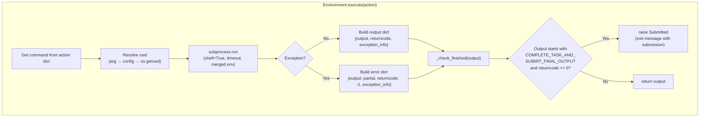

# TDD Guide: Porting LocalEnvironment to Go

This guide walks through porting the Python `LocalEnvironment` to Go using strict TDD (red-green-refactor). Each step builds on the previous one. Complete them in order.

This is the natural successor to [tdd_default_agent_go.md](file:///home/rvald/mini-swe-agent/docs/tdd_default_agent_go.md). By the end, you'll have a real `Environment` implementation that can execute bash commands, detect task completion, report platform info, and serialize its config.

> [!IMPORTANT]
> **Source of truth:** Always refer back to [local.py](file:///home/rvald/mini-swe-agent/src/minisweagent/environments/local.py) and [docker.py](file:///home/rvald/mini-swe-agent/src/minisweagent/environments/docker.py) when in doubt about behavior. The `LocalEnvironment` and `DockerEnvironment` share `_check_finished` logic.

---

## How the Python LocalEnvironment Works (Reference)

Before writing any code, internalize this control flow:



### Key Python Components

| Python Component | What it does | Go equivalent |
|---|---|---|
| `LocalEnvironmentConfig` | Holds `cwd`, `env` (extra env vars), `timeout` | Go struct |
| `LocalEnvironment.__init__` | Stores config | `NewLocalEnvironment()` constructor |
| `execute(action)` | Runs shell command via `subprocess.run` | `os/exec` with `cmd.Output()` |
| `_check_finished(output)` | Detects `COMPLETE_TASK_AND_SUBMIT_FINAL_OUTPUT` sentinel | Private method, returns `*SubmittedError` |
| `get_template_vars()` | Merges config + `platform.uname()` + `os.environ` | `runtime.GOOS` + `os.Environ()` |
| `serialize()` | Returns config metadata nested dict | Method returning `map[string]any` |

### Python execution details

```python
# subprocess.run key args:
#   shell=True          → Go: use "bash", "-c", command
#   text=True           → Go: output is already string
#   stdout=PIPE         → Go: CombinedOutput() captures both
#   stderr=STDOUT       → Go: merge stderr into stdout
#   timeout=30          → Go: context.WithTimeout
#   encoding="utf-8"    → Go: default
#   errors="replace"    → Go: handle manually if needed
#   env=os.environ|config.env  → Go: merge os.Environ() with config
```

---

## File Structure

```
internal/
├── types/
│   ├── types.go            # Shared: Message, Action, Observation
│   └── errors.go           # Shared: SubmittedError, InterruptAgentFlowError, etc.
├── utils/
│   └── merge.go            # Shared: RecursiveMerge
├── agent/
│   ├── types.go            # AgentConfig, Model/Environment interfaces, type aliases
│   ├── default.go          # DefaultAgent logic
│   └── default_test.go     # Agent tests
└── environment/
    ├── types.go            # LocalEnvironmentConfig
    ├── local.go            # LocalEnvironment logic
    └── local_test.go       # All tests (white-box)
```

At the top of every environment file:

```go
package environment
```

> [!NOTE]
> **Shared types are already extracted.** `Action`, `Observation`, `Message`, and error types (`SubmittedError`, etc.) all live in `internal/types/`. The `utils.RecursiveMerge` function lives in `internal/utils/`. Both `agent` and `environment` import from these shared packages — no circular dependencies.
>
> The `LocalEnvironment` satisfies `agent.Environment` via Go's implicit interface satisfaction. Since both packages use the same `types.Action` and `types.Observation`, the method signatures match automatically.

---

## Phase 1: Config

### Step 1.1 — LocalEnvironmentConfig

**What it is in Python:**
```python
class LocalEnvironmentConfig(BaseModel):
    cwd: str = ""
    env: dict[str, str] = {}
    timeout: int = 30
```

**🔴 RED** — In `local_test.go`:

```go
func TestLocalEnvironmentConfigDefaults(t *testing.T) {
    cfg := LocalEnvironmentConfig{}
    if cfg.Cwd != "" {
        t.Errorf("Cwd = %q, want empty", cfg.Cwd)
    }
    if cfg.Env == nil {
        t.Error("Env should not be nil after construction")
    }
    if cfg.Timeout != 0 {
        t.Errorf("Timeout = %d, want 0 (set default in constructor)", cfg.Timeout)
    }
}
```

> [!NOTE]
> **Go zero values vs Python defaults.** In Python, `timeout: int = 30` gives a default. In Go, `int` zero-values to `0`. We'll set the default timeout in the constructor, matching the pattern from `NewDefaultAgent` where constructor logic applies defaults.

**🟢 GREEN** — In `types.go`:

```go
type LocalEnvironmentConfig struct {
    Cwd     string
    Env     map[string]string
    Timeout int
}
```

**🔄 REFACTOR** — Nothing yet.

---

## Phase 2: Constructor

### Step 2.1 — NewLocalEnvironment

**What Python `__init__` does:**
```python
def __init__(self, *, config_class: type = LocalEnvironmentConfig, **kwargs):
    self.config = config_class(**kwargs)
```

**🔴 RED:**

```go
func TestNewLocalEnvironment(t *testing.T) {
    env := NewLocalEnvironment(LocalEnvironmentConfig{})
    if env == nil {
        t.Fatal("env should not be nil")
    }
    if env.config.Timeout != 30 {
        t.Errorf("default Timeout = %d, want 30", env.config.Timeout)
    }
    if env.config.Env == nil {
        t.Error("Env map should be initialized")
    }
}

func TestNewLocalEnvironmentCustomConfig(t *testing.T) {
    cfg := LocalEnvironmentConfig{
        Cwd:     "/tmp",
        Timeout: 10,
        Env:     map[string]string{"FOO": "bar"},
    }
    env := NewLocalEnvironment(cfg)
    if env.config.Cwd != "/tmp" {
        t.Errorf("Cwd = %q, want '/tmp'", env.config.Cwd)
    }
    if env.config.Timeout != 10 {
        t.Errorf("Timeout = %d, want 10", env.config.Timeout)
    }
    if env.config.Env["FOO"] != "bar" {
        t.Errorf("Env[FOO] = %q, want 'bar'", env.config.Env["FOO"])
    }
}
```

**🟢 GREEN** — In `local.go`:

```go
type LocalEnvironment struct {
    config LocalEnvironmentConfig
}

func NewLocalEnvironment(cfg LocalEnvironmentConfig) *LocalEnvironment {
    if cfg.Timeout == 0 {
        cfg.Timeout = 30
    }
    if cfg.Env == nil {
        cfg.Env = make(map[string]string)
    }
    return &LocalEnvironment{config: cfg}
}
```

---

## Phase 3: Execute — Happy Path

### Step 3.1 — Simple Command Execution

**What Python does:**
```python
result = subprocess.run(
    command, shell=True, text=True, cwd=cwd,
    env=os.environ | self.config.env,
    timeout=timeout or self.config.timeout,
    stdout=subprocess.PIPE, stderr=subprocess.STDOUT,
)
output = {"output": result.stdout, "returncode": result.returncode, "exception_info": ""}
```

This runs a shell command with `shell=True` (Bash interprets it), captures stdout+stderr together, and returns a dict with the output, return code, and empty exception info.

**🔴 RED:**

```go
func TestExecuteEchoCommand(t *testing.T) {
    env := NewLocalEnvironment(LocalEnvironmentConfig{})
    action := Action{Command: "echo hello"}

    obs, err := env.Execute(action)
    if err != nil {
        t.Fatalf("unexpected error: %v", err)
    }
    if strings.TrimSpace(obs.Output) != "hello" {
        t.Errorf("Output = %q, want 'hello'", obs.Output)
    }
    if obs.ReturnCode != 0 {
        t.Errorf("ReturnCode = %d, want 0", obs.ReturnCode)
    }
    if obs.ExceptionInfo != "" {
        t.Errorf("ExceptionInfo = %q, want empty", obs.ExceptionInfo)
    }
}
```

> [!NOTE]
> **Where does `Action` come from?** `Action` and `Observation` live in `internal/types/types.go` (the shared types package). Import them in your environment package:
> ```go
> import "github.com/rvald/code-rig/internal/types"
> type Action = types.Action
> type Observation = types.Observation
> ```
> Or reference them as `types.Action` / `types.Observation` directly.

**🟢 GREEN** — In `local.go`:

```go
import (
    "bytes"
    "os"
    "os/exec"
)

func (e *LocalEnvironment) Execute(action Action) (Observation, error) {
    cwd := e.config.Cwd
    if cwd == "" {
        cwd, _ = os.Getwd()
    }

    ctx, cancel := context.WithTimeout(context.Background(), time.Duration(e.config.Timeout)*time.Second)
    defer cancel()

    cmd := exec.CommandContext(ctx, "bash", "-c", action.Command)
    cmd.Dir = cwd
    cmd.Env = e.mergeEnv()

    var outBuf bytes.Buffer
    cmd.Stdout = &outBuf
    cmd.Stderr = &outBuf

    runErr := cmd.Run()

    if ctx.Err() == context.DeadlineExceeded {
        return Observation{
            Output:        outBuf.String(),
            ReturnCode:    -1,
            ExceptionInfo: fmt.Sprintf("An error occurred while executing the command: %v", ctx.Err()),
        }, nil
    }

    if runErr != nil {
        // Command failed but didn't timeout — check for exit code
        if exitErr, ok := runErr.(*exec.ExitError); ok {
            obs := Observation{
                Output:        outBuf.String(),
                ReturnCode:    exitErr.ExitCode(),
                ExceptionInfo: "",
            }
            return e.checkFinished(obs)
        }
        // Other error (command not found, etc.)
        return Observation{
            Output:        outBuf.String(),
            ReturnCode:    -1,
            ExceptionInfo: fmt.Sprintf("An error occurred while executing the command: %v", runErr),
        }, nil
    }

    obs := Observation{
        Output:     outBuf.String(),
        ReturnCode: 0,
    }
    return e.checkFinished(obs)
}

func (e *LocalEnvironment) mergeEnv() []string {
    env := os.Environ()
    for k, v := range e.config.Env {
        env = append(env, k+"="+v)
    }
    return env
}
```

> [!WARNING]
> **`shell=True` → `bash -c`.** Python's `subprocess.run(command, shell=True)` passes the string to `/bin/sh -c`. We use `bash -c` explicitly to match the mini-swe-agent's expected shell behavior (the Docker environment also uses `bash -lc`). If you want to match Python exactly, you could use `sh -c`, but `bash` is safer for the agent's expected command syntax.

---

### Step 3.2 — Custom Working Directory

**Python behavior:** `cwd = cwd or self.config.cwd or os.getcwd()`

The precedence is: explicit argument → config → current directory.

**🔴 RED:**

```go
func TestExecuteWithCustomCwd(t *testing.T) {
    dir := t.TempDir()
    env := NewLocalEnvironment(LocalEnvironmentConfig{Cwd: dir})
    action := Action{Command: "pwd"}

    obs, err := env.Execute(action)
    if err != nil {
        t.Fatalf("unexpected error: %v", err)
    }
    // pwd output should match the temp dir
    got := strings.TrimSpace(obs.Output)
    if got != dir {
        t.Errorf("pwd output = %q, want %q", got, dir)
    }
}
```

**🟢 GREEN** — Already handled in Step 3.1: `cmd.Dir = cwd` uses `e.config.Cwd` or falls back to `os.Getwd()`.

---

### Step 3.3 — Custom Environment Variables

**Python behavior:** `env=os.environ | self.config.env` — merges OS env with config env, config takes precedence.

**🔴 RED:**

```go
func TestExecuteWithCustomEnvVars(t *testing.T) {
    env := NewLocalEnvironment(LocalEnvironmentConfig{
        Env: map[string]string{"MY_TEST_VAR": "hello_from_config"},
    })
    action := Action{Command: "echo $MY_TEST_VAR"}

    obs, err := env.Execute(action)
    if err != nil {
        t.Fatalf("unexpected error: %v", err)
    }
    if strings.TrimSpace(obs.Output) != "hello_from_config" {
        t.Errorf("Output = %q, want 'hello_from_config'", obs.Output)
    }
}
```

**🟢 GREEN** — Already handled via `mergeEnv()` in Step 3.1.

> [!TIP]
> **Go `cmd.Env` behavior.** When you set `cmd.Env`, it completely replaces the environment — unlike Python's `os.environ | config.env` which starts from the parent. That's why `mergeEnv()` starts with `os.Environ()` (the current process environment) and appends the config overrides. Go processes the slice in order, so later entries override earlier ones with the same key.

---

## Phase 4: Execute — Error Cases

### Step 4.1 — Nonzero Exit Code

**Python behavior:** A command with a nonzero exit code returns normally (not an exception) with `returncode` set.

**🔴 RED:**

```go
func TestExecuteNonzeroExitCode(t *testing.T) {
    env := NewLocalEnvironment(LocalEnvironmentConfig{})
    action := Action{Command: "exit 42"}

    obs, err := env.Execute(action)
    if err != nil {
        t.Fatalf("unexpected error (should not propagate): %v", err)
    }
    if obs.ReturnCode != 42 {
        t.Errorf("ReturnCode = %d, want 42", obs.ReturnCode)
    }
    if obs.ExceptionInfo != "" {
        t.Errorf("ExceptionInfo = %q, want empty (nonzero exit is not an exception)", obs.ExceptionInfo)
    }
}
```

> [!NOTE]
> **Key design decision: `Execute` never returns a Go error for command failures.** The Python version catches all exceptions and packs them into the output dict. The only thing that "escapes" is `Submitted` (which we handle via the `checkFinished` return). A nonzero exit code is a normal observation, not an error. The `error` return from `Execute` is reserved for truly unexpected failures (e.g., `bash` binary not found on the system).

**🟢 GREEN** — Already handled in Step 3.1. The `exec.ExitError` branch captures the exit code and returns an `Observation` without propagating the error.

---

### Step 4.2 — Stderr Gets Merged Into Output

**Python behavior:** `stderr=subprocess.STDOUT` merges stderr into stdout.

**🔴 RED:**

```go
func TestExecuteStderrMergedIntoOutput(t *testing.T) {
    env := NewLocalEnvironment(LocalEnvironmentConfig{})
    action := Action{Command: "echo 'to stdout' && echo 'to stderr' >&2"}

    obs, err := env.Execute(action)
    if err != nil {
        t.Fatalf("unexpected error: %v", err)
    }
    if !strings.Contains(obs.Output, "to stdout") {
        t.Errorf("Output should contain 'to stdout', got %q", obs.Output)
    }
    if !strings.Contains(obs.Output, "to stderr") {
        t.Errorf("Output should contain 'to stderr' (merged from stderr), got %q", obs.Output)
    }
}
```

**🟢 GREEN** — Already handled: both `cmd.Stdout` and `cmd.Stderr` point to the same `bytes.Buffer`.

---

### Step 4.3 — Command Timeout

**Python behavior:** When `timeout` is exceeded, `subprocess.TimeoutExpired` is caught. The partial output (if any) is captured, and the observation gets `returncode: -1` with exception info.

```python
except Exception as e:
    raw_output = getattr(e, "output", None)
    output = {
        "output": raw_output,
        "returncode": -1,
        "exception_info": f"An error occurred while executing the command: {e}",
    }
```

**🔴 RED:**

```go
func TestExecuteTimeout(t *testing.T) {
    env := NewLocalEnvironment(LocalEnvironmentConfig{Timeout: 1})
    action := Action{Command: "sleep 30"}

    obs, err := env.Execute(action)
    if err != nil {
        t.Fatalf("unexpected error (timeout should not propagate): %v", err)
    }
    if obs.ReturnCode != -1 {
        t.Errorf("ReturnCode = %d, want -1", obs.ReturnCode)
    }
    if obs.ExceptionInfo == "" {
        t.Error("ExceptionInfo should describe the timeout")
    }
}
```

**🟢 GREEN** — Already handled in Step 3.1 via `context.WithTimeout`. The `context.DeadlineExceeded` check fires before we interpret the run error.

> [!CAUTION]
> **Timeout kills the process.** `exec.CommandContext` sends `SIGKILL` when the context expires. Unlike Python's `TimeoutExpired` which may leave orphan processes, Go's context cancellation is more aggressive. The partial output captured in `outBuf` may be incomplete. This matches the Python behavior where `getattr(e, "output", None)` gets whatever was captured before the timeout.

---

### Step 4.4 — Command Not Found

**Python behavior:** If the command itself is invalid (e.g., a binary that doesn't exist), the exception is caught with the same handler.

**🔴 RED:**

```go
func TestExecuteCommandNotFound(t *testing.T) {
    env := NewLocalEnvironment(LocalEnvironmentConfig{})
    action := Action{Command: "nonexistent_command_xyz_12345"}

    obs, err := env.Execute(action)
    if err != nil {
        t.Fatalf("unexpected error (should be packed into observation): %v", err)
    }
    // bash returns 127 for "command not found"
    if obs.ReturnCode != 127 {
        t.Errorf("ReturnCode = %d, want 127", obs.ReturnCode)
    }
}
```

> [!NOTE]
> **Bash handles this for us.** Because we run `bash -c command`, bash itself returns exit code 127 for unknown commands. We don't get a Go-level `exec.Error` — bash runs fine, it just reports a command-not-found error in its own way. The `exec.ExitError` path captures the 127 return code.

**🟢 GREEN** — Already handled.

---

## Phase 5: Submission Detection

### Step 5.1 — _check_finished / checkFinished

**What Python does:**
```python
def _check_finished(self, output: dict):
    lines = output.get("output", "").lstrip().splitlines(keepends=True)
    if lines and lines[0].strip() == "COMPLETE_TASK_AND_SUBMIT_FINAL_OUTPUT" and output["returncode"] == 0:
        submission = "".join(lines[1:])
        raise Submitted({
            "role": "exit",
            "content": submission,
            "extra": {"exit_status": "Submitted", "submission": submission},
        })
```

Key behaviors:
1. Leading whitespace is stripped before splitting (`lstrip()`)
2. The first line (after stripping) must be exactly `COMPLETE_TASK_AND_SUBMIT_FINAL_OUTPUT`
3. The return code must be `0`
4. Everything after the first line becomes the `submission` payload
5. If not matched, the output passes through unchanged

In Go, we can't raise an exception from `Execute`. Instead, `checkFinished` will return a `*SubmittedError` as the error value. The `SubmittedError` type is defined in `internal/types/errors.go`.

> [!NOTE]
> **Cross-package error type — already resolved.** `SubmittedError` lives in `internal/types/errors.go`. The environment package imports it directly:
> ```go
> import "github.com/rvald/code-rig/internal/types"
> ```
> The `DefaultAgent.executeActions()` in the agent package uses `errors.As(err, &flow)` to detect `InterruptAgentFlowError`, which `SubmittedError` embeds. This works seamlessly across packages.

**🔴 RED:**

```go
func TestCheckFinishedDetectsSubmission(t *testing.T) {
    env := NewLocalEnvironment(LocalEnvironmentConfig{})
    action := Action{Command: `printf "COMPLETE_TASK_AND_SUBMIT_FINAL_OUTPUT\nmy answer\n"`}

    _, err := env.Execute(action)

    var submitted *SubmittedError
    if !errors.As(err, &submitted) {
        t.Fatalf("expected SubmittedError, got %T: %v", err, err)
    }
    if submitted.Submission != "my answer\n" {
        t.Errorf("Submission = %q, want %q", submitted.Submission, "my answer\n")
    }
    if submitted.ExitStatus != "Submitted" {
        t.Errorf("ExitStatus = %q, want 'Submitted'", submitted.ExitStatus)
    }
}
```

**🟢 GREEN** — In `local.go`:

```go
import "github.com/rvald/code-rig/internal/types"

const submissionSentinel = "COMPLETE_TASK_AND_SUBMIT_FINAL_OUTPUT"

func (e *LocalEnvironment) checkFinished(obs Observation) (Observation, error) {
    if obs.ReturnCode != 0 {
        return obs, nil
    }
    trimmed := strings.TrimLeft(obs.Output, " \t\n\r")
    lines := strings.SplitAfter(trimmed, "\n")
    if len(lines) == 0 {
        return obs, nil
    }
    if strings.TrimSpace(lines[0]) != submissionSentinel {
        return obs, nil
    }
    submission := strings.Join(lines[1:], "")
    return obs, types.NewSubmittedError(submission)
}
```

> [!TIP]
> Use `types.NewSubmittedError(submission)` — the constructor in `internal/types/errors.go` handles building the `InterruptAgentFlowError` with the correctly-formatted exit `Message`. No need to define a local `SubmittedError`.
```

---

### Step 5.2 — No Submission on Nonzero Exit Code

**Python behavior:** Even if the output contains the sentinel, `_check_finished` only fires when `returncode == 0`.

**🔴 RED:**

```go
func TestCheckFinishedIgnoresNonzeroExitCode(t *testing.T) {
    env := NewLocalEnvironment(LocalEnvironmentConfig{})
    // The sentinel is present but the command fails
    action := Action{Command: `printf "COMPLETE_TASK_AND_SUBMIT_FINAL_OUTPUT\nmy answer\n" && exit 1`}

    obs, err := env.Execute(action)
    if err != nil {
        t.Fatalf("should not return error for failed command with sentinel: %v", err)
    }
    if obs.ReturnCode == 0 {
        t.Error("ReturnCode should be nonzero")
    }
}
```

**🟢 GREEN** — Already handled: `checkFinished` checks `obs.ReturnCode != 0` first.

---

### Step 5.3 — No Submission Without Sentinel

**🔴 RED:**

```go
func TestCheckFinishedPassesThroughNormalOutput(t *testing.T) {
    env := NewLocalEnvironment(LocalEnvironmentConfig{})
    action := Action{Command: "echo 'just a normal command'"}

    obs, err := env.Execute(action)
    if err != nil {
        t.Fatalf("unexpected error: %v", err)
    }
    if obs.ReturnCode != 0 {
        t.Errorf("ReturnCode = %d, want 0", obs.ReturnCode)
    }
    if !strings.Contains(obs.Output, "just a normal command") {
        t.Errorf("Output = %q, should contain 'just a normal command'", obs.Output)
    }
}
```

**🟢 GREEN** — Already handled.

---

### Step 5.4 — Multiline Submission

**Python behavior:** Everything after the first line is the submission. This can be multiple lines.

**🔴 RED:**

```go
func TestCheckFinishedMultilineSubmission(t *testing.T) {
    env := NewLocalEnvironment(LocalEnvironmentConfig{})
    action := Action{Command: `printf "COMPLETE_TASK_AND_SUBMIT_FINAL_OUTPUT\nline1\nline2\nline3\n"`}

    _, err := env.Execute(action)

    var submitted *SubmittedError
    if !errors.As(err, &submitted) {
        t.Fatalf("expected SubmittedError, got %T: %v", err, err)
    }
    expected := "line1\nline2\nline3\n"
    if submitted.Submission != expected {
        t.Errorf("Submission = %q, want %q", submitted.Submission, expected)
    }
}
```

**🟢 GREEN** — Already handled: `strings.Join(lines[1:], "")` preserves all lines after the sentinel.

---

### Step 5.5 — Leading Whitespace Before Sentinel

**Python behavior:** `output.lstrip()` strips leading whitespace before checking. So `"\n  COMPLETE_TASK_AND_SUBMIT_FINAL_OUTPUT\n..."` still matches.

**🔴 RED:**

```go
func TestCheckFinishedLeadingWhitespace(t *testing.T) {
    env := NewLocalEnvironment(LocalEnvironmentConfig{})
    action := Action{Command: `printf "\n  COMPLETE_TASK_AND_SUBMIT_FINAL_OUTPUT\nmy answer\n"`}

    _, err := env.Execute(action)

    var submitted *SubmittedError
    if !errors.As(err, &submitted) {
        t.Fatalf("expected SubmittedError even with leading whitespace, got %T: %v", err, err)
    }
    if submitted.Submission != "my answer\n" {
        t.Errorf("Submission = %q, want %q", submitted.Submission, "my answer\n")
    }
}
```

**🟢 GREEN** — Already handled: `strings.TrimLeft(obs.Output, " \t\n\r")` strips leading whitespace.

---

## Phase 6: GetTemplateVars

### Step 6.1 — Platform and Config Information

**What Python does:**
```python
def get_template_vars(self, **kwargs) -> dict[str, Any]:
    return recursive_merge(self.config.model_dump(), platform.uname()._asdict(), os.environ, kwargs)
```

This merges four sources:
1. Config fields (`cwd`, `env`, `timeout`)
2. Platform info (`system`, `node`, `release`, `version`, `machine`)
3. OS environment variables
4. Any extra kwargs

The template in `default.yaml` uses `{{system}}`, `{{release}}`, `{{version}}`, `{{machine}}` from `platform.uname()`.

In Go, `runtime.GOOS` gives the OS and `runtime.GOARCH` gives the architecture. For more detailed info, use `os.Hostname()` and `syscall.Uname` (Linux) or the `golang.org/x/sys` package.

**🔴 RED:**

```go
func TestGetTemplateVars(t *testing.T) {
    env := NewLocalEnvironment(LocalEnvironmentConfig{Cwd: "/tmp", Timeout: 10})
    vars := env.GetTemplateVars()

    // Config fields should be present
    if vars["cwd"] != "/tmp" {
        t.Errorf("cwd = %v, want '/tmp'", vars["cwd"])
    }
    if vars["timeout"] != 10 {
        t.Errorf("timeout = %v, want 10", vars["timeout"])
    }

    // Platform info should be present
    if _, ok := vars["system"]; !ok {
        t.Error("should have 'system' key from platform info")
    }
    if _, ok := vars["machine"]; !ok {
        t.Error("should have 'machine' key from platform info")
    }
}
```

**🟢 GREEN:**

```go
import (
    "os"
    "runtime"
)

func (e *LocalEnvironment) GetTemplateVars() map[string]any {
    configVars := map[string]any{
        "cwd":     e.config.Cwd,
        "timeout": e.config.Timeout,
    }

    hostname, _ := os.Hostname()
    platformVars := map[string]any{
        "system":  runtime.GOOS,
        "machine": runtime.GOARCH,
        "node":    hostname,
    }

    // Merge: config → platform → os.Environ
    envVars := make(map[string]any)
    for _, entry := range os.Environ() {
        if k, v, ok := strings.Cut(entry, "="); ok {
            envVars[k] = v
        }
    }

    return utils.RecursiveMerge(configVars, platformVars, envVars)
}
```

> [!NOTE]
> **`RecursiveMerge` lives in `internal/utils/merge.go`.** Import it as:
> ```go
> import "github.com/rvald/code-rig/internal/utils"
> ```

> [!TIP]
> **Linux-specific platform info.** Python's `platform.uname()` returns `(system, node, release, version, machine)`. On Linux, `release` is the kernel version (e.g., `6.5.0-14-generic`) and `version` is the full version string. You can get these from `/proc/version` or `syscall.Uname` on Linux, but for a first pass, `runtime.GOOS` and `runtime.GOARCH` plus `os.Hostname()` cover the template variables actually used in `default.yaml`: `{{system}}`, `{{release}}`, `{{version}}`, `{{machine}}`.

---

## Phase 7: Serialize

### Step 7.1 — Config Metadata

**What Python does:**
```python
def serialize(self) -> dict:
    return {
        "info": {
            "config": {
                "environment": self.config.model_dump(mode="json"),
                "environment_type": "minisweagent.environments.local.LocalEnvironment",
            }
        }
    }
```

**🔴 RED:**

```go
func TestSerialize(t *testing.T) {
    env := NewLocalEnvironment(LocalEnvironmentConfig{Cwd: "/tmp", Timeout: 10})
    data := env.Serialize()

    info, ok := data["info"].(map[string]any)
    if !ok {
        t.Fatal("data should have 'info' key with map value")
    }
    config, ok := info["config"].(map[string]any)
    if !ok {
        t.Fatal("info should have 'config' key with map value")
    }
    envConfig, ok := config["environment"].(map[string]any)
    if !ok {
        t.Fatal("config should have 'environment' key with map value")
    }
    if envConfig["cwd"] != "/tmp" {
        t.Errorf("cwd = %v, want '/tmp'", envConfig["cwd"])
    }
    if envConfig["timeout"] != 10 {
        t.Errorf("timeout = %v, want 10", envConfig["timeout"])
    }
    envType, ok := config["environment_type"].(string)
    if !ok || envType == "" {
        t.Error("should have 'environment_type' string")
    }
}
```

**🟢 GREEN:**

```go
func (e *LocalEnvironment) Serialize() map[string]any {
    return map[string]any{
        "info": map[string]any{
            "config": map[string]any{
                "environment": map[string]any{
                    "cwd":     e.config.Cwd,
                    "env":     e.config.Env,
                    "timeout": e.config.Timeout,
                },
                "environment_type": "environment.LocalEnvironment",
            },
        },
    }
}
```

---

## Phase 8: Integration — Satisfies the Agent Interface

### Step 8.1 — Interface Compliance

This test verifies that `LocalEnvironment` satisfies the `Environment` interface from the agent package. This is an integration-level check.

Add a compile-time check inside `local.go`:

```go
import "github.com/rvald/code-rig/internal/agent"

// Compile-time check that LocalEnvironment satisfies the agent.Environment interface.
var _ agent.Environment = (*LocalEnvironment)(nil)
```

**🔴 RED:**

```go
// In a test file that can import both packages:
func TestLocalEnvironmentSatisfiesInterface(t *testing.T) {
    var e agent.Environment = NewLocalEnvironment(LocalEnvironmentConfig{})
    if e == nil {
        t.Fatal("LocalEnvironment should satisfy agent.Environment")
    }
}
```

**🟢 GREEN** — Since both `agent` and `environment` use the same `types.Action` and `types.Observation` from `internal/types/`, Go's implicit interface satisfaction works automatically. The compile-time check above will fail at build time if any method signature is wrong.

---

## Summary — Implementation Order

| Step | Test file | Production file | What you're proving |
|---|---|---|---|
| 1.1 | `TestLocalEnvironmentConfigDefaults` | `types.go` | Config struct exists |
| 2.1 | `TestNewLocalEnvironment*` | `local.go` | Constructor with defaults |
| 3.1 | `TestExecuteEchoCommand` | `local.go` | Basic command execution works |
| 3.2 | `TestExecuteWithCustomCwd` | — | Working directory is respected |
| 3.3 | `TestExecuteWithCustomEnvVars` | — | Config env vars passed to command |
| 4.1 | `TestExecuteNonzeroExitCode` | — | Failed commands return exit code |
| 4.2 | `TestExecuteStderrMergedIntoOutput` | — | Stderr captured in output |
| 4.3 | `TestExecuteTimeout` | — | Timeout returns -1 with exception info |
| 4.4 | `TestExecuteCommandNotFound` | — | Missing command returns 127 |
| 5.1 | `TestCheckFinishedDetectsSubmission` | `local.go` | Sentinel detection works |
| 5.2 | `TestCheckFinishedIgnoresNonzeroExitCode` | — | Sentinel ignored on failure |
| 5.3 | `TestCheckFinishedPassesThroughNormalOutput` | — | Normal output unaffected |
| 5.4 | `TestCheckFinishedMultilineSubmission` | — | Multiline payload preserved |
| 5.5 | `TestCheckFinishedLeadingWhitespace` | — | Leading whitespace stripped |
| 6.1 | `TestGetTemplateVars` | `local.go` | Platform + config vars merged |
| 7.1 | `TestSerialize` | `local.go` | Config metadata structure |
| 8.1 | `TestLocalEnvironmentSatisfiesInterface` | — | Implements agent interface |

---

## Refactoring Reminder

The following refactoring has already been completed (shared types and merge utility extraction). One remaining opportunity:

1. ~~**Shared types package**~~ — ✅ Done. `Action`, `Observation`, `Message`, and error types live in `internal/types/`.

2. ~~**Shared merge utility**~~ — ✅ Done. `RecursiveMerge` lives in `internal/utils/merge.go`.

3. **Platform info** — Add `release` and `version` fields to `GetTemplateVars()` by reading `/proc/version` or using `syscall.Uname` on Linux. These are used in the `default.yaml` instance template.
